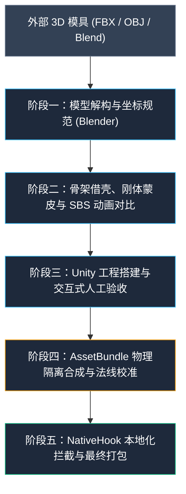

# 硬表面角色“借壳”绑定与自动化打包管线全指南 (Hard-Surface Character Grafting & Packaging Guide)

本指南总结了在《变形金刚：百炼为战》（Transformers: Forged to Fight，简称 TFTF）离线复活重构工程中，将外部第三方高质量 3D 模型（如来自《银河试炼》Galactic Trials 的艾丽塔 Elita One、《领袖之证》破坏者 Demolishor 等）成功“借壳”移植到官方角色骨架与招式系统上的完整技术管线与避坑实录。

---

## 0. 本地工具链固定路径规范 (Toolchain Standard Paths)

> [!IMPORTANT]
> **严禁在磁盘上循环/递归全盘搜索 `blender.exe` 或 `Unity.exe`！**  
> 本工程的所有建模与构建工具链均预置在 `toolchain/` 目录下，路径恒定，必须直接调用：

| 工具名称 | 物理绝对路径 / 相对路径 | 版本与用途 | 命令行调用示例 |
| :--- | :--- | :--- | :--- |
| **Blender** | `E:\Agent\TFTF-blender\toolchain\blender\blender.exe` | 3.6.23 (无头渲染/蒙皮/网格处理) | `& "E:\Agent\TFTF-blender\toolchain\blender\blender.exe" -b -P <script.py>` |
| **Unity Editor** | `E:\Agent\TFTF-blender\toolchain\Unity_2020.3.31f1\Editor\Unity.exe` | 2020.3.31f1 (无头构建 AssetBundle / 动画) | `& "E:\Agent\TFTF-blender\toolchain\Unity_2020.3.31f1\Editor\Unity.exe" -batchmode -quit ...` |
| **Unity Project** | `E:\Agent\TFTF-blender\toolchain\unity_build_project` | 标准验收与 AssetBundle 导出工程 | `-projectPath "E:\Agent\TFTF-blender\toolchain\unity_build_project"` |
| **Zipalign** | `E:\Agent\TFTF-blender\toolchain\android-13\zipalign.exe` | APK 对齐工具 | `.\toolchain\android-13\zipalign.exe -f -p 4 ...` |
| **Apksigner** | `E:\Agent\TFTF-blender\toolchain\android-13\apksigner.bat` | APK 签名工具 | `cmd /c ".\toolchain\android-13\apksigner.bat sign ..."` |

---

## 1. 核心架构与“借壳”理念总览

### 1.1 什么是“借壳”？
在 TFTF 游戏中，官方拥有成熟的招式碰撞框、受击判定、连招状态机、过场变形逻辑以及高度优化的动画骨架（如阿尔茜 Arcee 的 63 骨骼体系，铁皮 Ironhide 的 68 骨骼体系）。  
**“借壳”**是指：选取官方同体型、同性别或同招式骨架的角色作为**母壳（Host Chassis）**，将外部下载的新模具经过拓扑、缩放、旋转对齐后，把新模型的顶点蒙皮权重映射到母壳骨骼上，从而完全继承母壳的全套轻重攻击、翻滚、闪避、必杀技（SP1~SP3）以及受击形变。



---

## 2. 阶段一：外部 3D 模具预处理与坐标系对齐 (Blender)

### 2.1 坐标系与变换冻结 (Freeze Transforms)
- **坐标系转换差异**：
  - Unity：左手坐标系，**$Y$-Up, $Z$-Forward**。
  - Blender：右手坐标系，**$Z$-Up, $-Y$-Forward**。
  - 导出 FBX 必须严格配置：`Forward = -Z Forward`, `Up = Y Up`（或在导出脚本中使用矩阵转换）。
- **必须执行变换应用**：
  在 Blender 中必须对新模型执行 `Apply All Transforms`（快捷键 `Ctrl + A` -> `All Transforms`），确保网格的 Location 为 `(0, 0, 0)`、Rotation 为 `(0, 0, 0)`、Scale 为 `(1, 1, 1)`。未应用缩放会导致进入 Unity 后出现千倍缩放或动画位移爆炸。

### 2.2 纹理通道解构 (PBR Textures)
TFTF 采用定制的移动端 PBR 着色器，纹理通常拆分为三大通道：
1. **Diffuse (主漫反射 / BaseColor)**：RGBA 格式。注意阿尔茜等官方角色的 Alpha 通道可能存有特定遮罩，但机甲主体应使用纯白/不透明通道。
2. **Normal (法线贴图)**：注意切线空间法线格式。若外部模型是 DirectX 格式（绿色通道为负），需翻转绿通道（Invert Green Channel）以转为 Unity 支持的 OpenGL 标准。
3. **RAOE / Misc (粗糙度/金属度/环境光遮蔽/发光复合贴图)**：
   - R 通道：Roughness（粗糙度）
   - G 通道：Ambient Occlusion（AO 环境光遮蔽）
   - B 通道：Metallic（金属度）
   - A 通道：Emission（自发光遮罩）

---

## 3. 阶段二：Blender 姿态匹配与刚体蒙皮 (Rigid Grafting)

### 3.1 提取母壳骨架与 Rest Pose 矩阵
使用 Python 脚本从官方母壳 AssetBundle（如 `arcee_gs_deluxe2014.assetbundle`）中提取所有骨骼的 Local Transform 与 BindPose 逆矩阵。
在 Blender 中生成一套与官方 1:1 完全一致的 Armature 骨架。

### 3.2 刚体孤岛单一骨骼吸附（硬表面核心法则）
> [!IMPORTANT]
> **切勿对硬表面机甲使用平滑渐变蒙皮权重（Smooth Skinning）！**
> 生物角色（如人体、怪兽）需要平滑插值，但变形态金刚的装甲、车轮、面罩是由金属机械构件构成的。如果一个车轮外壳的顶点同时受到大臂（50%）和小臂（50%）的拉扯，在挥拳时车轮会被拉长变形，变成“橡胶机甲”。

**推荐方案：连通孤岛（Connected Mesh Island）刚体权重传递**：
1. 将网格分割成若干连通孤岛（通过 `bpy.ops.mesh.separate(type='LOOSE')` 或 KD-Tree 聚类）。
2. 计算每个孤岛的几何中心与母壳各个骨骼的距离/包围盒重合度。
3. 将该孤岛的所有顶点以 **100% 权重（Weight = 1.0）** 分配给最近的主导骨骼，其他骨骼权重置 0。

### 3.3 Blender 阶段 Side-by-Side (并排) 动画初筛人工验收
不要盲目导入引擎。在 Blender 中编写无头测试脚本，执行以下初筛：
1. **并排布局**：
   - 屏幕左侧：新角色（带移植权重）；
   - 屏幕右侧：官方母壳角色（原版骨架与网格）；
2. **加载动作切片**：
   - 选取 4 个最具代表性的动作：`Idle`（待机站姿）、`attackLight_01`（直拳）、`attackLight_04`（高踢腿/侧踢）、`victory`（胜利特写）。
3. **逐帧渲染**：
   - 截取起手帧（Windup）、击中帧（Impact）、收招帧（Recovery），渲染为高清并排对比图（`side_by_side_frameXX.png`）交付人工验收。
   - **验收关键点**：关节弯曲时外壳是否穿插、轮毂是否跟随躯干运动、头部是否发生异常拉伸。

---

## 4. 阶段三：Unity 工程搭建与交互式人工验收

### 4.1 搭建纯净检测场景 (`Inspection Scene`)
1. **相机与灯光配置**：
   - 搭建正前视角摄像机，垂直高度设在机甲中心（约 $Y=4.2\text{m}$），FOV 设为 45°~48°，拉开合适距离实现从头到脚全身入画。
   - 开启三点布光：主光（Key Light，暖色高光）、辅助光（Fill Light，冷色漫射）、轮廓光（Rim Light，背面冷高光）。
2. **地面与穿透预防**：
   - **避坑警告**：Unity 默认自带的 Plane 在 $Y=0$ 处。如果模型鞋底刚好在 $Y=0$ 或稍有下沉，地面平面会导致足部被大面积截断遮挡，误判为“脚部模型丢失”。在验收角色全身时，**应将地面网格禁用或设为透明下沉**。

### 4.2 交互式动画预览控制器 (`AnimationPreviewController.cs`)
在 Unity 中编写挂载于场景中的可视化交互控制器，必须具备：
1. **3D 屏幕空间头顶浮动标签**：
   在每个角色头顶计算 `Camera.main.WorldToScreenPoint`，绘制醒目标签：
   - 左侧角色头顶：**`艾丽塔 (Elita One 新角色)`**
   - 右侧角色头顶：**`阿尔茜 (Arcee 官方原版)`**
   > [!TIP]
   > 极其重要的工程习惯！当两个角色的色系相近、且并排同台展示时，肉眼极其容易对调混淆角色，导致在排查问题时产生误判。
2. **GUI 动作面板**：
   提供一键切换按钮：待机、轻击 1~4、重击、冲刺、胜利，在 Play 模式下可实时点击观察关节动态。

---

## 5. 核心大坑与避坑指南 (The Hall of Pitfalls)

在此次移植过程中，我们经历了数次极为隐蔽的“致命大坑”，必须严格遵循以下避坑守则：

### 坑 1：法线误判反转导致“无脸男”与“空心外壳”（Backface Culling）
* **故障现象**：在 Blender 或 Unity 中正面视角一切正常，但在特定角度或游戏内置 Shader（开启 `Cull Back`）渲染时，**面部变成黑洞（无脸）、车轮轮毂中空透视、膝盖与胯部出现穿透性大洞**。
* **致命根因**：
  许多自动化修复法线的脚本使用了**基于散度定理的高斯体积积分公式**：
  $$\text{Volume} = \sum_{f} \frac{1}{6} \vec{v}_0 \cdot (\vec{v}_1 \times \vec{v}_2)$$
  该数学公式在**封闭流形几何体（Water-tight closed mesh）**上完全成立（体积为正代表法线朝外，为负代表反向）。**但是机甲的面部贴片、肩甲边缘、膝盖护壳本质上是非封闭的开放曲面（Open surface / Single-sided shell）！**  
  开放曲面计算出的体积积分很可能是负数，导致脚本错误地将面部、轮毂曲面的顶点索引顺逆顺序整体反转！Unity 渲染时把正面当成了背面进行剔除，导致面部完全隐形！
* **解决守则**：
  1. **严禁对非封闭硬表面模型盲目执行全自动“翻转负体积孤岛”脚本**。
  2. 优先保留外部原始 FBX 经过验证的面朝向；若材质只渲染单面，优先在 Shader/材质侧设置 Cull Off 或通过局部手动选中修复。

---

### 坑 2：骨骼顺序错位（Cross-Wiring）导致“进游戏全身散架、头掉地上”
* **故障现象**：在 Unity 编辑器中点击播放，角色动作行云流水非常协调；但一打包进 APK 进入游戏，角色瞬间**“完全散架”、头被扯掉掉在脚边地上、手脚反向乱飞、身首异处**！
* **致命根因**：
  1. 在 Unity 中调试时，我们挂载的网格权重是按照**阿尔茜母壳的 63 根骨骼顺序**（`0: Spine, 1: Hips, 2: LeftUpLeg, 3: LeftForeArm ...`）映射生成的。
  2. 打包脚本（如早期的 `generate_elita_one_bundle.py`）误从外部未处理的 FBX 中读取了 64 根骨骼的层次表（其顺序为 `0: Reference, 1: Hips, 2: LeftUpLeg, 3: LeftLeg ...`）。
  3. 脚本错误地将母壳 SMR 的 `m_Bones` 和 `m_BindPose` 强行重写成了外部 FBX 的 64 根乱序骨骼。
  4. **灾难发生**：网格里手臂顶点记着自己归“3 号骨骼”管，但在游戏运行时，3 号骨骼被替换成了“腿部（LeftLeg）”！头部顶点被替换成了“脚趾”！导致全身骨骼严重交叉错位，人物当场四分五裂！
* **解决守则**：
  > [!CAUTION]
  > **母壳的骨骼顺序是不可动摇的单一真理源！**
  - 母壳 SMR 有几根骨骼（如 63 根），顺序是什么，最终 AssetBundle 里就必须完完全全保留这 63 根骨骼与对应的 BindPoses。
  - 严禁将外部 FBX 的 Bone 数组强行覆盖进游戏母壳 SMR。网格的 `Stream 2`（蒙皮索引）必须与母壳的 `m_Bones` 保持 1:1 绝对一致。

---

### 坑 3：Unity 双 Prefab SMR 骨骼指针交叉污染（Cross-Prefab Bone Bleed）
* **故障现象**：在角色展示界面（Showcase）模型完好，一旦进入战斗加载轻量模型（Combat `_lw`）就产生骨骼撕裂或闪退。
* **致命根因**：
  官方 AssetBundle 中同一角色通常存在两个独立的 Prefab 实例：
  - Prefab 1：展示模型（包含复杂的微动骨骼与配饰）
  - Prefab 2：战斗轻量模型（`_lw`，优化碰撞与多边形）
  这两个 Prefab 拥有各自完全独立的 Transform 实例（PathID 互不相同）。如果脚本在重定向 SMR 的 `m_Bones` 时，把 Prefab 2 的骨骼指针错误指向了 Prefab 1 的 Transform，就会引发跨 Prefab 内存冲突。
* **解决守则**：
  提取 Transform 时必须从各自 Prefab 的根节点递归检索映射表：
  ```python
  pref_tr = p1_transforms if is_p1 else p2_transforms
  new_bones = [{"m_FileID": 0, "m_PathID": pref_tr[bname]} for bname in arcee_smr_bones]
  ```

---

### 坑 4：Unity 在 Play Mode 下构建 AssetBundle 抛异常
* **故障现象**：在 Unity 编辑器中点击打包菜单毫无反应，控制台隐蔽报错：  
  `InvalidOperationException: Building AssetBundles while in play mode is not allowed, please exit play mode first.`
* **致命根因**：Unity 编辑器在运行时锁死了 AssetBundle 构建管道。
* **解决守则**：
  在 C# `AssetBundleBuilder` 脚本中增加状态拦截与自动退出逻辑：
  ```csharp
  if (EditorApplication.isPlaying) {
      Debug.LogWarning("[AssetBundleBuilder] Exiting Play Mode first...");
      EditorApplication.isPlaying = false;
      EditorApplication.update += QueueBuildAfterPlayMode;
      return;
  }
  ```

---

### 坑 5：UnityPy 打包未加 LZ4 压缩导致 APK 空间暴涨
* **致命根因**：UnityPy 的 `env.file.save()` 默认参数为 `packer=None`（非压缩 Raw 格式），会导致 10MB 的 AssetBundle 膨胀至 40MB，直接撑爆 APK 包体并引发移动端加载 OOM。
* **解决守则**：必须显式声明 `save(packer="lz4")`。

---

### 坑 6：Mesh 网格 `m_BoneNameHashes` 数量或哈希与母壳 Avatar 脱节导致“首次进入战斗闪退 (SIGSEGV fault addr 0x1)”
* **故障现象**：在主界面、展厅、战队编队界面新角色模型动作完美展现；但首次点击“开战”进入副本战斗时，游戏瞬间闪退崩溃（日志报 `signal 11 (SIGSEGV), code 1 (SEGV_MAPERR), fault addr 0x1`，崩溃堆栈位于 `libil2cpp.so` 的 Mecanim 动画骨骼解析与卸载例程）；重开游戏后由于断点恢复直接进入战斗场景，战斗却完全正常运行。
* **致命根因**：
  Unity 引擎在 C++ 底层维护 Mecanim 骨骼动画与 Avatar 时，网格（Mesh）内部必须维持严格的数学与结构一致性：
  $$\text{BindPoses 数量} = \text{BoneNameHashes 数量} = \text{SMR Bones 数量}$$
  新模型经外部 Unity 编译为 AssetBundle 时，其网格自带了外部 Unity 生成的骨骼哈希列表（如 64 个哈希），且这些哈希在官方母壳 Avatar 的 TOS（Transform/Skeleton 字典）中的匹配率为 **0%**。
  若在资产包嫁接合成脚本中，只替换了 `m_BindPose`（63 阶），却遗漏了同步替换 `m_BoneNameHashes`，会导致：
  1. 数组长度不匹配（64 vs 63）；
  2. 网格内部所声明的骨骼哈希在当前角色 Avatar 中完全未知。
  
  **为什么首次进战斗崩溃、重开直接进战斗却正常？**
  - **首次进战斗路径**：游戏在战队编队界面先加载了展厅模型（Prefab 1），点击开战后，Unity 引擎在同一个渲染帧内**销毁展厅模型并释放其动画组件**，同时加载战斗轻量模型（Prefab 2）。Mecanim 底层在遍历网格解绑 Avatar 骨骼析构时，因 `m_BoneNameHashes` 数量超出 `m_Bones` 且哈希非法，指针寻址越界触发 `fault addr 0x1` 空指针异常闪退。
  - **重开游戏路径**：客户端重启后检测到战斗已在进行，直接恢复进入战斗场景（Prefab 2），完全跳过了展厅模型的加载与卸载销毁过程，从而掩盖了该析构越界 bug。
* **解决守则**：
  在从母壳提取真值时，必须同时提取母壳的 `m_BoneNameHashes`；在注入新网格时，必须强制使 `m_BoneNameHashes` 严格等于母壳真值：
  ```python
  robot_mesh["m_BindPose"] = arcee_bindposes
  robot_mesh["m_BoneNameHashes"] = arcee_bone_hashes  # 必须与 arcee_bindposes 长度一致且与 Avatar TOS 100% 匹配
  assert len(robot_mesh["m_BoneNameHashes"]) == len(robot_mesh["m_BindPose"])
  ```

---

### 坑 7：巨石重建脚本导致已验收人形网格反复被易失中间件覆盖躺平（Monolithic Rebuild & Volatile Mesh Overwrite）
* **故障现象**：仅想对贴图或材质参数微调（例如抬升 AO 消除黑斑、降低粗糙度增加光泽、调高眼睛自发光），结果重新执行自动化打包后，原本已经在游戏里站立正常的人形**再次躺平在地、散架扭曲**。
* **致命根因**：
  1. **管线职责未解耦**：将“3D 几何网格重建与骨架映射”与“材质参数/贴图纹理热补丁”混在同一个巨石脚本（如 `generate_character_bundle.py`）中。
  2. **中间构建产物的易失性与污染传递**：巨石脚本在生成 AssetBundle 时，会盲目从上游中间件（如 `toolchain/unity_build_project/AssetBundles/mesh.assetbundle`）重新提取网格。但中间件往往来自 Blender 未烘焙空间变换、或未配置坐标轴转换的易失 FBX，处于躺平倒地或轴向错乱的未修复状态。一旦为了改贴图重新运行巨石脚本，就会无差别把游戏中原本已修好的“黄金站立网格”覆盖破坏。
* **避坑工程规范与三重防线**：
  - **第一道防线：职责彻底分离与原位补丁（In-Place Surgical Patching）**：
    凡是仅涉及 Diffuse、Normal、RAOE 贴图或 Material Shader 属性的调整，**绝对禁止调用全量重建脚本**！必须使用专用的原位修补脚本（如 `patch_textures_and_materials_only.py`），对已有 AssetBundle 原位读取，**物理隔离并严格禁止修改任何 Mesh、BindPose、SMR、Transform 数据**。
  - **第二道防线：空间几何健康度断言守门（Mesh Bounds & Orientation Hard Assertion）**：
    在所有打包脚本与验收脚本中，必须加入模型空间高度强校验，一旦发现网格未站立（$Y$ 轴与 $Z$ 轴颠倒），立即引发异常并终止写入：
    ```python
    c_y = mesh["m_LocalAABB"]["m_Center"]["y"]
    c_z = mesh["m_LocalAABB"]["m_Center"]["z"]
    # 人形机甲站立时高度中心通常在 3.5m ~ 5.0m；若躺平则 Y 接近 0 且 Z 达到 4m+
    assert c_y > 3.0, f"FATAL: Robot Mesh is lying down! Center Y={c_y}"
    assert abs(c_z) < 1.0, f"FATAL: Robot Mesh coordinates swapped! Center Z={c_z}"
    ```
  - **第三道防线：黄金网格资产快照冻结（Golden Mesh Freezing）**：
    一旦人形骨骼、旋转与蒙皮在真机验收无误，立即将其 typetree 固化为只读黄金快照。全量构建脚本即使被触发，也必须优先采用已冻结的权威网格，严禁无感知读取易失临时中间件。

---

## 6. 阶段四：全自动 AssetBundle 合成与游戏植入

### 6.1 核心合成脚本范式 (`generate_character_bundle.py`)
一个健壮的自动化打包脚本必须严格执行以下原子步骤：

```python
# 1. 载入 Unity 导出的新 Mesh 与母壳 AssetBundle
c_env = UnityPy.load("toolchain/unity_build_project/AssetBundles/mesh.assetbundle")
i_env = UnityPy.load("extracted_apk/assets/assetpack/mother_chassis.assetbundle")

# 2. 提取母壳权威 63 骨骼与 BindPoses (不容更改)
arcee_bindposes, arcee_smr_bones = extract_authoritative_rig(i_env)

# 3. 提取并注入嫁接后的新网格 (赋予母壳原始 Mesh 名)
robot_mesh = get_mesh(c_env, "cha_elita_one_grafted")
robot_mesh["m_Name"] = "cha_arcee_gs_deluxe2014_00"
robot_mesh["m_BindPose"] = arcee_bindposes

# 4. 严格隔离双 Prefab 骨骼重新寻址
for obj in i_env.objects:
    if obj.type.name == "SkinnedMeshRenderer":
        smr = obj.read_typetree()
        if len(smr["m_Bones"]) == len(arcee_smr_bones):
            pref_tr = p1_transforms if (obj.path_id == P1_ID) else p2_transforms
            smr["m_Bones"] = [{"m_FileID": 0, "m_PathID": pref_tr[b]} for b in arcee_smr_bones]
            smr["m_RootBone"] = {"m_FileID": 0, "m_PathID": pref_tr["Hips"]}
            obj.save_typetree(smr)

# 5. 注入高精度 Diffuse, Normal, RAOE 贴图并替换 CAB 字符串
# 6. 使用 LZ4 格式保存最终 AssetBundle
with open("assets_redeco/character_gs.assetbundle", "wb") as f:
    f.write(i_env.file.save(packer="lz4"))
```

---

## 7. 阶段五：本地化、Native Hook 拦截与无感发布

为了让新移植的角色在游戏中拥有完整的身份沉浸感，需同步配置 4 个层级的本地化数据：

### 7.1 特殊攻击（必杀技 SP1~SP3）配置
在 [`assets/xlate/custom_special_attacks.json`](file:///e:/Agent/TFTF-blender/assets/xlate/custom_special_attacks.json) 中为角色注册技能中英文名与描述：
```json
"elita_one_gs": {
  "display_name": "艾丽塔",
  "specials": [
    { "name": "塞伯坦急袭", "desc": "艾丽塔以极快的身法突进并发动敏捷连击..." },
    { "name": "超能裂地击", "desc": "汇聚高能等离子冲击波轰击地面..." },
    { "name": "时间停滞·终极制裁", "desc": "激活传说中的时间停止核心力场..." }
  ]
}
```
运行 `python tools/generate_special_attacks.py` 自动编译进底层 C 头文件 [`tools/nativehook/special_attacks_zh.h`](file:///e:/Agent/TFTF-blender/tools/nativehook/special_attacks_zh.h)。

### 7.2 运行时虚表底层拦截 (`tools/nativehook/hook.c`)
在 `hook_162`（`Localization.Get` 拦截器）中加入角色中文名与传记（Bio）的高优先级返回：
```c
if (strstr(k, "ELITA") || strstr(k, "elita") || strstr(k, "Elita")) {
    if (strstr(k, "BIO") || strstr(k, "desc")) {
        return g_strnew("艾丽塔是塞伯坦女性汽车人反抗军的勇敢领袖之一...");
    }
    return g_strnew("艾丽塔");
}
```

### 7.3 离线数据库与元数据同步
- 同步更新 [`bot_names_zh.json`](file:///e:/Agent/TFTF-blender/bot_names_zh.json) 与 [`Server/bot_names_zh.json`](file:///e:/Agent/TFTF-blender/Server/bot_names_zh.json)。
- 运行 `python build_apk.py` 执行最终自动化打包、Zipalign 对齐与 V2/V3 签名。

---

## 8. 总结清单：新角色“借壳”上机检查表 (Checklist)

在每次引入新 3D 模具移植时，必须逐项核对：
- [ ] **Blender 变换应用**：Position/Rotation/Scale 是否已全部 Apply 为 0/0/1？
- [ ] **刚体孤岛蒙皮**：所有机甲零散构件是否均为 100% 单一刚体权重，无平滑变形？
- [ ] **Blender SBS 验收**：是否已截取 Windup / Strike / Recovery 关键帧确认无穿帮？
- [ ] **Unity 防穿透**：地平面是否已禁用，确认脚部足底完整展现？
- [ ] **Unity 标签标注**：头顶 3D 浮动标签是否已正确标明新角色与母壳对照？
- [ ] **法线无开孔**：是否已剔除错误的负体积孤岛翻转脚本，确保脸孔轮毂非空心？
- [ ] **骨骼序列与哈希一致**：AssetBundle 内 SMR `m_Bones`、`m_BindPose` 与 `m_BoneNameHashes` 是否完全等于母壳官方骨骼表，且哈希与 Avatar TOS 100% 匹配，绝无混入外部 FBX 骨骼与哈希？
- [ ] **SMR 双 Prefab 物理隔离**：Showcase 与 Combat LW 是否各自引用自己内部的 Transform？
- [ ] **LZ4 压缩保护**：`save(packer="lz4")` 是否生效，AssetBundle 大小是否在 10MB 左右？
- [ ] **空间高度正立断言**：Mesh 与 SMR 的 Center $Y$ 是否处于站立区间（$Y > 3.0\text{m}$，Extent $Y > 3.0\text{m}$），严防网格轴向颠倒躺平？
- [ ] **贴图材质原位隔离**：后续调整贴图或 Shader 浮点参数时，是否使用了原位补丁脚本（`patch_textures_and_materials_only.py`），绝不重新运行巨石全量网格重建？
- [ ] **全套汉化闭环**：角色名、Bio 传记、SP1~SP3 技能是否已全部通过 Hook 拦截与头文件生成？
