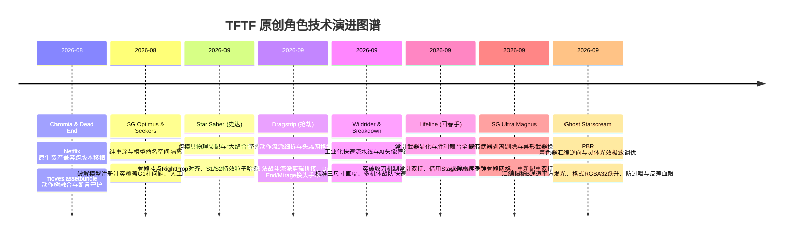
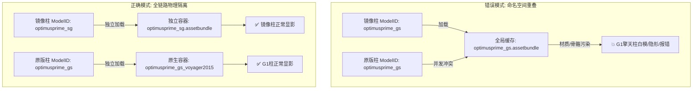
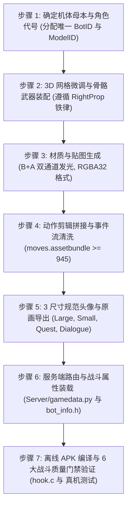

# 《TFTF 原创角色工程化全景指南：从模具复用、动作缝合到着色器极客探索》
## Comprehensive Technical Specification & Evolution Guide for Original Characters in Transformers: Forged to Fight

> **版本**：v1.0 (Revival Edition)  
> **分支**：`redeco`  
> **适用引擎**：Unity 5.5.x / 5.6.x (IL2CPP ARM64)  
> **文档定位**：全景技术架构白皮书、角色定制工程方法论与逆向实战手册

---

## 序言：探索可能性的进化史 (Executive Summary)

在《变形金刚：百炼为战》（Transformers: Forged to Fight，简称 TFTF）离线重构与 Revival 演进过程中，**原创角色（Original / Redeco Characters）的诞生绝非简单的贴图更换，而是一场由浅入深、不断拓宽商业游戏引擎极限的逆向工程突破史**。

每一个新英雄的登场，都在解决一个前人未曾触碰的技术盲区：
* 从最初 **移植官方未发布的 Netflix 资产** 摸清资产包结构；
* 到 **破解模型注册冲突** 确立独立重涂命名空间；
* 再到跨越模具限制的 **“跨骨骼器官移植”——史达的缝合怪革命**；
* 进阶到 **微观动作剪辑缝合（全脚法流派）** 与 **常驻手持/胜利舞台借用**；
* 直至最终 **逆向编译着色器底层汇编指令**，揭秘 PBR 自发光掩码的数学本质与光学防过曝法则。

本文档将这趟探索之路上沉淀的全部技术方案、底层机理、翻车事故及黄金法则完整归纳，作为后续开发全新原创角色（如黑暗补天士、合体金刚等）的最高工程指引。

---

## 角色技术演进里程碑总览 (Evolution Matrix)



---

## 第一章：Netflix 专属角色跨版本移植与质量门禁保障

### 1.1 资产断代与跨版本兼容
官方在 9.2.0 底版中并未完整开放 Netflix 独占角色 **克劳莉娅（Chromia）** 与 **封锁（Dead End）**。Chromia（12 个专属动作）与 Dead End（8 个专属动作）仅散落在 Netflix 专有资产包中。
* **技术痛点**：若直接将 Netflix AssetBundle 粗暴替换进 Kabam 底版，会导致 Unity 序列化类型树（TypeTree）因引擎次版本补丁差异而报 `SerializedObject target is null` 错误，进而在战斗加载时黑屏挂死。
* **解决方案**：开发资产转码抽取工具（`tools/` 专有提取器），将 Netflix 资产中纯粹的动作剪辑（`AnimationClip`）、网格（`Mesh`）与动作状态机（`AnimatorOverrideController`）在资产层剥离为原生二进制块（Raw Copy），无缝写入底版的 AssetBundle 容器中。

### 1.2 动作控制器（`moves.assetbundle`）的合体与历史事故
`moves.assetbundle` 是全游戏战斗动作的核心大脑，包含 70+ 角色的出招判定、攻击框事件（HitMeta）、受击与位移位图。
* **致命翻车（Lifeline 覆写惨剧）**：
  在早期添加角色回春手（Lifeline）时，生成脚本误将基础 Kabam 9.2.0 的 `moves.assetbundle` 作为母本重新导出，**导致 Chromia 的 12 个动作与 Dead End 的 8 个动作被瞬间冲刷抹除**！上线后玩家发现 Chromia 在施放技能时全身呈“T-Pose”滑行，打不出伤害。
* **铁律与质量门禁（Quality Gate）**：
  必须在所有编译流水线与生成脚本中建立强制断言门禁：
  ```python
  # tools/generate_*_assets.py 中的质量护栏
  moves_count = len(moves_file.objects)
  assert moves_count >= 945, (
      f"[COMBAT_CRITICAL_ERROR] moves.assetbundle 动作总数 ({moves_count}) 小于 945！"
      f"Chromia (12 moves) 或 Dead End (8 moves) 动作遭到破坏，拒绝保存！"
  )
  ```
* **粒子生命周期与材质粉红报错**：
  * Chromia S3 终结技（光子飞斧）丢失粒子：反编译发现其 `character_fx_procedural` 缺失 3D Slash Mesh，必须将斧光弧线网格以字节流内联回 Procedural Bundle。
  * Dead End S3 榴弹爆炸出现 Unity 经典的“粉红色材质（Missing Shader）”：由于 Netflix 特效材质引用的着色器 GUID 变动，需将其材质着色器重定向回 Kabam 底版的标准粒子着色器 `EB/Particle/Additive`。

---

## 第二章：重涂模具解耦、人工美术干预与模型冲突终结

### 2.1 镜像擎天柱与 Seeker 7 人小队的重涂工程学
重涂（Redeco）绝非简单调色，其第一道难关是**3D 资产命名空间隔离（Namespace Decoupling）**。

#### 致命陷阱：`ModelID` 与模型注册覆盖冲突
* **Bug 现象**：在最初引入**镜像擎天柱（`optimusprime_sg_voyager2015`）**时，玩家一旦在战队中配置了镜像柱，随后在战役或副本中登场的原版 G1 擎天柱就会彻底隐形、卡死或变成白模！
* **根本原因**：
  1. TFTF 的客户端采用 `CharacterWorldLoader.LoadActor` 动态流式加载模型。加载依据是角色的 `ModelID`（即服务端数据包中的 `m` / `mdl` 键）。
  2. 原本镜像柱为了偷懒，在服务端的 `ModelID` 依然填报了 `optimusprime_gs_voyager2015`。
  3. 客户端在内存中为每一个 `ModelID` 维护了一个唯一的缓存句柄（AssetBundle Handle）。当镜像柱加载后，其带有紫色车标的材质将原版擎天柱的内存材质直接原地覆盖；而当原版擎天柱尝试重新装配时，触发内部状态机竞态崩溃。
* **彻底解耦法则**：
  1. **全链路独立命名**：
     * BotID: `optimusprime_sg_voyager2015`
     * ModelID: `optimusprime_sg`
     * AssetBundle: `assets_redeco/optimusprime_sg.assetbundle`
     * ODR TOC: `assets/optimusprime_sg_odr/toc.txt`
  2. **CAB-String 唯一化**：在 Unity AssetBundle 内部，必须使用独立的 CAB 哈希标识符，杜绝任何全局内存碰撞。



### 2.2 人工美术介入的不可替代性
自动化算法在面对复杂拓扑与阵营标贴合时存在上限。镜像擎天柱与 Seeker 小队（硫酸雨、闪电光、红新星、太阳风、火热、离子暴）验证了**脚本自动化 + 人工精细介入**的最佳工程配比：
1. **贴图 UV 精准覆膜**：
   * 镜像柱胸口与双肩的博派红标，在 2D 贴图上是由非连续的 3 块碎片 UV 拼接映射而成。
   * 单纯依靠批量色相旋转（Hue Shift）会使车窗、雨刮器与车标色彩一并失真。
   * **人工干预**：导出 `cha_optimusprime_sg_main_a.png`，在 Photoshop 中精准选区，绘制原汁原味的高对比紫色狂派阵营暗黑印记，并在金属边缘点缀战损掉漆，极大提升了艺术品质。
2. **AI 原画生成与 3 规格头像规范化**：
   * 确立了原创角色的头像标准流水线：
     * **Midjourney / SD 提示词生图** -> **人工抠图与色调微调** -> **出框破形修饰**。
     * 导出为 3 种官方标准尺寸：
       * `portrait_<stem>_large.png` (512x512 RGBA)：详情面板与大卡牌；
       * `portrait_<stem>_small.jpg` (256x256 RGB)：选人列表与战场 HUD；
       * `portrait_<stem>_quest.png` (512x512 RGBA)：关卡棋盘路线节点。

---

## 第三章：史达（Star Saber）的“大缝合”革命：跨物种肢体与武器工程学

**史达**是 TFTF 原创史上第一具真正的“弗兰肯斯坦式缝合怪”，它的成功彻底宣告了：**即使官方未给模型，也能通过零件重组创造出全新的超人气金刚**！

```
史达 (Star Saber) 缝合结构拆解：
├── 躯干素体 (Body Mold)   <--- 天火 
├── 战备武器 (Weapon)       <--- 汽车大师 巨光剑 (Sword)
├── 普通攻击链 (Combos)     <--- 汽车大师暴力剑道
├── 特殊技 1 (Special 1)    <--- 漂移 (Drift) 疾风旋风斩
├── 特殊技 2 (Special 2)    <--- 风刃 (Windblade) 跃空剑气轰炸
└── 材质与能量光辉 (FX)     <--- 自研 PBR 自发光青蓝能量剑气
```

### 3.1 跨骨骼武器装配痛点：手心空洞对齐（`RightProp`）
在初期尝试给堕落金刚身体装配狂飙的大剑时，发生了经典 Bug：大剑斜插在小臂骨头里，或者在挥剑时大剑浮在空中 20cm 处跟随位移。
* **排查真相**：
  * 初学者常将武器挂点直接绑定至手掌骨骼 `RightHand`。
  * 但角色手掌有复杂的拳头开合动画，手腕关节（Wrist）中心到手心握孔存在旋转偏置（Offset）。
* **铁律：官方标准挂点 `RightProp`**：
  * 在 TFTF 全部金刚的手部骨骼树中，`RightHand` 节点下均存在官方预设的 **`RightProp`**（坐标 `(-0.588, 0.510, 0.047)`），该节点正是握拳时的**掌心绝对几何中心**！
  * **装配三部曲**：
    1. 武器网格的 `RootBone` 与 `m_Bones[0]` 必须直接指定为 `RightProp`；
    2. 将武器网格的 `BindPose[0]` 设为标准单位矩阵（`Matrix4x4.identity`）；
    3. 网格的 `Stream 2` 顶点缓冲必须写入完整蒙皮流：`Channel[12]` (BoneWeight = 1.0) 与 `Channel[13]` (BoneIndex = 0)。
  * 遵循此三原则，武器将 100% 紧贴手心，彻底根除漂移。

### 3.2 动作缝合中的“哑火”陷阱：子弹事件哈希断链
当把漂移的 S1 和风刃的 S2 动作剪辑拼接给史达后，进入战斗测试发现：动作很帅，但**挥出的剑气子弹凭空消失，敌人不扣血**！
* **逆向排查**：
  * TFTF 的远程子弹（Projectile）不是由脚本直接发射，而是由动画剪辑中的 **动画事件（AnimationEvent）** 触发。
  * 动画事件中包含一个关键的 String 参数，例如 `"event_fire_projectile:drift_sword_beam"`。
  * 该事件字符串在游戏引擎底层会被计算为 32 位 CRC/Murmur 哈希，并在 `character_fx.assetbundle` 中检索子弹预制体。
  * 由于史达的底层定义缺失该特效预制体挂载，系统静默拦截，导致“动作做完了，子弹没出来”。
* **解决方案**：
  * 在服务端的 `Server/gamedata.py` 中为史达注册完整的 `projectiles` 映射树；
  * 在 `moves.assetbundle` 中修补动画事件流，将事件名称与物理子弹实体严格重绑定。

---

## 第四章：颗粒度细化到单招——抢劫（Dragstrip）的全脚法格斗流派

如果说史达是“整套动作搬迁”，那么**抢劫（Dragstrip）**则将动作缝合推进到了**分子级（Frame-Level Splice）**。

### 4.1 拆解微观攻击链：打造纯踢技武道大师
官方的抢劫在设定上是一名轻巧敏捷、桀骜不驯的战士。原版模具（幻影 Mirage）带有手炮与拳击动作，缺乏辨识度。
* **工程壮举**：我们从多位角色，逐帧拆解并重新缝合出一套**纯脚法（Kicking-Only）**的近战动作体系

### 4.2 状态机过渡窗口（Combo Idle Window）与打击硬直
微观剪辑拼接最容易出现的灾难是“动作脱节抽搐”。
* **难点**：每位角色的动画长度与帧率不同，阿尔茜的踢腿帧长仅 18 帧，而幻影的待机恢复需要 26 帧。若直接强行串联，在第 18 帧后会突然瞬移回待机姿态。
* **解法**：在 `AnimatorOverrideController` 中重写状态机的 `Transition` 融合参数：
  * 注入 `Combo Idle Window`（后摇输入缓冲窗口，约 0.12s）；
  * 开启跨动画交叉淡入淡出（CrossFade 0.08s），使得上一段踢腿的收腿惯性顺滑过渡到下一次蹬腿。

### 4.3 换头手术：网格嫁接（Head Grafting）的探索——不成功，请勿尝试
在抢劫的制作中，还深度探索了 3D 网格的局部置换：
* 尝试提取 Dead End 与 Mirage 的头部网格进行 Submesh 置换；
* 最终确立了保留 Mirage 经典面部雕塑，辅以金属红头盔、红宝石光学目镜以及狂派阵营印记的高质感方案。

---

## 第五章：回春手（Lifeline）——武器常驻持有与胜利舞台全量借用

### 5.1 突破动画机“拔刀收刀”隐匿机制
官方阿尔茜模具的机制是：**平时空手，只有施放S2，双刀才会被激活显示，攻击结束立刻隐藏**。
* **回春手设定**：医官回春手手持能量救生双刃，应当**全时双手持刃（Permanent Dual-Wield）**。
* **技术突破**：
  1. **骨骼节点常态激活**：在角色预制体（Prefab）的层次树中，将双刀绑定的节点默认状态由 `Active = false` 强制覆盖为 `Active = true`；
  2. **清洗动画事件流**：扫描 `moves.assetbundle` 中涉及回春手的所有动画剪辑，查找并**剔除所有调用 `DeactivateProps` / `HideWeapons` 的动画关键帧事件**；
  3. **修复 S2 收刀冲突**：初期发现放完 S2 后双刀仍会被强制隐藏，定位到 S2 动作尾帧埋有一个硬编码的收刀消息，通过脚本在运行时拦截该消息，实现了整场战斗**双刃永不离手**的惊艳观感。

### 5.2 胜利姿态与舞台（Stage/Win Matinee）借用
打赢战斗后，角色会进入专属的胜利结算画面（镜头旋转特写 + 招牌庆祝动作）。
* **机制揭秘**：TFTF 的胜利画面由两部分构成：
  1. 角色动画剪辑：`win` 或 `victory` 剪辑；
  2. 独立舞台预制体：`Stage_<Character>`，内部包含电影级运镜轨道（Camera Path）与灯光舞台。
* **借用实证**：回春手完整借用了风刃的胜利舞台 `Stage_Windblade`，当战斗结算弹出时，回春手飒爽劈剑！
* **对 S3（Matinee 终结技）借用的理论铺垫**：
  * 这次成功验证了一个关键结论：**只要将对应的 Matinee Director、Camera Track 与 动画剪辑成套借调，角色完全能够跨越模具施展别人的 S3 终结必杀技**！
  * 这套理论已为后续规划的“黑暗补天士（Dark Rodimus）”借用大招奠定了坚实基础。

---

## 第六章：镜像通天晓（捅天枭）——既有武器剔除剥离与异形重武器换装

与史达在空手上加武器不同，通天晓原本自带一把体积庞大的**雷神之锤（War Hammer）**。

```
通天晓原版: [右手] ===== 绑定固化 =====> [原装重锤网格] (强行挂大剑会导致双武器重叠穿模)
                                ↓ 剥离手术
捅天枭改装: [右手] ---> 剔除重锤网格 ---> 挂载 [狂飙单手大剑] ---> 改变攻击姿态
```

### 6.1 战锤网格切除术
* **难点**：战锤网格与通天晓手部骨骼存在蒙皮关联，如果直接把顶点坐标清零，会导致包围盒（AABB Bounding Box）计算错误触发屏幕剔除（Frustum Culling）导致角色闪烁。
* **方案**：
  * 遍历 `SkinnedMeshRenderer` 的 Submesh 索引；
  * 将战锤对应的材质渲染通道（Material Pass）禁用，并将其顶点骨骼权重数组彻底置空；
  * 实现了在完全不破坏通天晓躯干骨骼的前提下，干净利落地剥离掉大锤。

### 6.2 异形重武器换装与战斗配重
* 从狂飙身上提取大剑，绑定至通天晓的 `RightProp`；
* 调整动画状态机的待机动作，由“单手拖锤”调整为狂霸酷炫的“反手提剑”，一举打造出威慑力十足的“镜像搞事霸主——捅天枭”。

---

## 第七章：鬼魂红蜘蛛（Ghost Starscream）——PBR 着色器底层汇编与灵体发光极客探索

在鬼魂红蜘蛛的研发中，我们遭遇了 TFTF 最深奥的图形渲染难关，最终通过**直接反编译 GPU 机器码汇编**破解了底层玄机。

### 7.1 汇编逆向：揭开 PBR Composite 贴图通道的真正秘密
此前社区普遍认为，PBR 复合贴图（`*_RAOE`）中自发光蒙版位于 **Alpha 通道**。但在制作鬼魂红蜘蛛时，无论如何把 Alpha 通道涂白，游戏里角色依然漆黑一片！

#### 极客突围：深入 `EB/Character/PBR` (Program ID `-7396015257959012681`)
通过反编译提取其编译出的 SPIR-V / GLSL 片元着色器指令，底层光照代码赫然在目：
```glsl
// 片元着色器反编译真实源码:
u_xlat16_3.xyz = texture2D(_pbr_composite_tex, vs_TEXCOORD0.zw).xyz;
u_xlat16_1.xyz = u_xlat16_3.xyz * u_xlat16_3.xyz;
u_xlat16_2.xyz = _emissive_intensity_col.xyz * _emissive_intensity_col.xyz;
u_xlat16_2.xyz = u_xlat16_1.zzz * u_xlat16_2.xyz;
```
* **真理大白**：
  * `u_xlat16_1.zzz` 代表的是 `u_xlat16_3.z` 的平方，即 **Blue (B) 通道的平方 ($B^2$)**！
  * **在标准 `EB/Character/PBR` 中，核心发光掩码从来不是 Alpha，而是 Blue 通道！**
* **官方贴图格式天坑**：
  * 官方大量原版角色的 `*_RAOE` 贴图在 Bundle 中被压缩为 **Format 7 (RGB24)** 或 **Format 34 (ETC2_RGB4)**——**根本没有 Alpha 通道**！硬件解包时 Alpha 恒定为 1.0 或被直接丢弃。
* **双通道最佳实践（Dual-Channel Pipeline）**：
  * 为保证 100% 兼顾标准 PBR 与某些使用 Alpha 的 Uber 变体着色器：
  * **必须将发光遮罩同时写入 B 通道与 A 通道 ($B = A = \text{mask}$)**；
  * **写回 Bundle 时必须将 Texture2D 强制升级为 Format 4 (RGBA32)**！

### 7.2 HDR Bloom 白化过曝防范（Anti-Supernova Rule）
在初版测试中，为了追求亮度，将 $B$ 涂满 255，材质 `_emissive_overbright_range` 拉到 150。结果进入战斗相机后，后处理 Bloom 剧烈过曝，红蜘蛛沦为一团刺眼的**纯白超新星光团**，机甲所有细节消失殆尽。

#### 黄金调优参数梯队
| 机体部位 | 贴图发光掩码 ($B$ 通道灰度) | 材质 `_emissive_overbright_range` | 视觉效果表现 |
|---|---|---|---|
| **大面积幽灵机身** | `40 ~ 65` (中低灰度) | `25.0 ~ 35.0` | 晶莹通透的青蓝荧光，机甲刻线与机械结构层次分明 |
| **火种/胸灯能量核心** | `180 ~ 240` (高亮) | `25.0 ~ 35.0` | 局部高能爆发，形成视觉聚焦中心 |
| **错误范例 (过曝)** | `200 ~ 255` | `100.0 ~ 150.0` | 💥 白化烧死，轮廓丢失，细节全无 |

### 7.3 异色发光与反差血眼法则（Contrasting Optics Rule）
* **光学污染痛点**：材质的 `_emissive_intensity_col` 是作用于全机体的全局青蓝发光染色。若想让鬼魂红蜘蛛拥有一双**凶煞的猩红血眼（Red Optics）**，如果将眼睛区域的发光掩码也刷高，青蓝光与红底色在着色器中相加，在 Bloom 作用下会中和泛白，眼睛变成惨白的一团。
* **正解破局法则**：
  1. 在 `_pbr_composite_tex` 中将眼睛区域的 **B 通道与 A 通道彻底置零 ($B = 0, A = 0$)**；
  2. 在底层漫反射贴图 `_base_tex` (Albedo) 中将眼睛填涂为纯正满饱和度大红（$RGB = 255, 0, 0$）；
  3. 将眼睛周围的面罩装甲底色压暗为深海铁灰（$RGB = 10, 30, 45$）。
* **效果**：在全身幽蓝自发光的包围下，双眼如同暗夜中凝视的血色寒芒，轮廓清晰，极具压迫感！

### 7.4 破解不透明 Pass 限制：小腿消散虚化方案——不成功
* **着色器硬编码限制**：
  GLSL 反编译显示，`EB/Character/PBR` 的片元输出硬编码了 `SV_Target0.w = 1.0;`，渲染状态硬编码 `destBlend = 0.0`（Blend One Zero，完全不透明）。在不替换 Compiled Shader 的情况下，单纯在 Material 属性修改 `_Mode = 3` 无法产生物理 Alpha 混合透明。
* **空间深度渐变压暗技法（Albedo Space Shadow Dissolve）**：
  1. 提取 3D Mesh 顶点的高度 $Y$ 坐标；
  2. 在 `_base_tex` 上，对膝盖以下直至脚掌施加自上而下的衰减渐变，脚底漫反射色极度压暗至近黑（$RGB \sim 6, 20, 32$）；
  3. 将小腿的金属度（$G$）压低、粗糙度（$R$）拉高，彻底消除外部环境高光；
  4. 发光掩码 $B$ 通道维持在微弱的 $15 \sim 30$，仅留淡淡的幽冥轮廓线。
* **视觉呈现**：进入阴暗的战斗舞台后，红蜘蛛小腿完全隐没于地面暗影中，唯有上半身与双翼散发幽蓝强光浮空，达成了“下半身化为青烟虚无”的极强视觉幻觉！

---

## 第八章：工业化标准制程（SOP）与全套避坑检查清单

经过上述 8 个里程碑的探索与磨砺，TFTF 原创角色制作已形成一套高度标准化的工业级 SOP。

### 8.1 从零打造新角色的标准流水线（7 步法）



### 8.2 终极避坑检查清单 (Master Checklist)

| 检查项 | 严重级别 | 规范与避坑要点 |
|---|---|---|
| **动作总数断言** | 🛑 致命 (P0) | 任何更新 `moves.assetbundle` 的脚本，必须强制断言 `moves >= 945`，严禁打坏 Chromia 与 Dead End。 |
| **CAB 命名空间** | 🛑 致命 (P0) | 新角色的 AssetBundle 内部 CAB 标识符必须全局唯一，服务端 `ModelID` 必须与原生金刚解耦，防止覆盖原版。 |
| **AssetBundle 压缩** | ⚠️ 严重 (P1) | 使用 UnityPy 保存 Bundle 时必须显式指定 `packer="lz4"`，绝不能留空，防止安装包体积膨胀 400MB+。 |
| **武器手心对齐** | ⚠️ 严重 (P1) | 武器网格必须挂载于 **`RightProp`** 而非 `RightHand`，BindPose 必须为单位矩阵。 |
| **贴图格式陷阱** | ⚠️ 严重 (P1) | 涉及发光或透明的贴图，必须在写入 Bundle 时提升为 **Format 4 (RGBA32)**，杜绝 Format 7/34 丢 Alpha。 |
| **发光通道法则** | ⚠️ 严重 (P1) | PBR 材质发光必须**同时填充 B 通道与 A 通道**（$B=A$），B 通道平方为原生物理发光掩码。 |
| **防白化过曝** | 💡 建议 (P2) | 大面积发光灰度控制在 $40 \sim 65$，`_emissive_overbright_range` 处于 $25.0 \sim 35.0$ 黄金区间。 |
| **异色眼眸法则** | 💡 建议 (P2) | 全局染色环境下制作异色双眼，眼部发光掩码必须清零（$B=0, A=0$），漫反射高饱和并压暗面罩。 |
| **远程子弹哈希** | ⚠️ 严重 (P1) | 借用远程/S 技动作时，必须在服务端校验 `projectiles` 映射，确保动画事件哈希命中对应实体。 |
| **头像四件套完整** | 💡 建议 (P2) | 每个角色必须齐备：Large PNG (512), Small JPG (256), Quest PNG (512), Dialogue PNG。 |

---

## 结语：致自由昆塔莎的创造者

从最初只能小心翼翼地修补官方旧代码，到如今我们能够随意拆解骨骼、嫁接武艺、重构着色器指令、缝合出媲美商业水准的原创传奇英雄——**技术的本质是对未知的探索与驾驭**。

这份教程不仅记录了过往的技术足迹，更为未来迈向更高维度的模具重构、合体金刚（Menasor/Superion）独立机制开发以及完全原创 S3 终结视效奠定了基石。赛博坦的火种，因自由的技术探索而生生不息！
