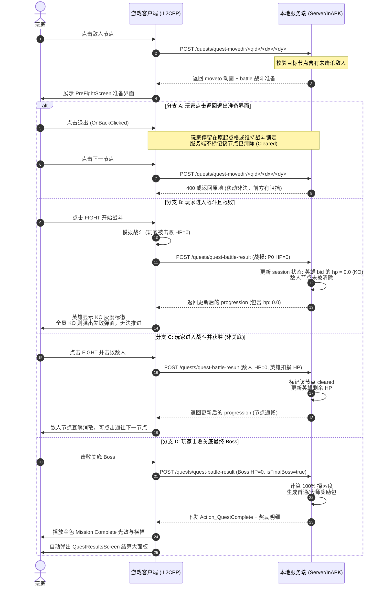

# 故事与特殊任务战役流、战斗结算与通关奖励系统技术分析与实现方案

## 一、问题背景与现状诊断

在当前的离线版游戏（Offline Version）中，战役故事模式（Story Mode）与特殊任务（Special Mission）的地图推进逻辑采用了极简的 Mock 原型实现，存在以下三个破坏核心游戏循环的简化设计缺陷：

1. **退出准备界面直接判胜（不战而胜）**：在地图上点击敌人节点后进入战斗准备界面（PreFightScreen），若此时点击“返回/退出”回到地图，该敌人节点直接被视为已通战胜，玩家位置被直接固化在该节点，可无阻碍继续点击下一节点前进。
2. **战败依然算通过且全员锁血不死（无 KO 机制）**：玩家进入战斗并被敌人打败后，回到地图依然视为该节点已通关，且玩家队伍中阵亡或残血的英雄在下一次地图交互时全部瞬间满血，角色头像不显示 KO 标记，无法形成队伍战损与车轮战策略。
3. **击败关底无通关提示与奖励展示（缺乏 Mission Complete）**：从起点一路通关至关底 Boss 并将其击败后，地图不会播放“Mission Complete”胜利横幅特效，也不会唤起通关大结算面板（`QuestResultsScreen`）来展示探索百分比、通关星级以及关卡首通/重复通关奖励。

---

## 二、底层逆向分析与机制根因 (Reverse Engineering Analysis)

基于对 `libil2cpp.so` 符号体系、`global-metadata.dat` 元数据结构以及服务端（`Server/gamedata.py`、`Server/fakeserver.py`、`inapk_server.c`）的全面逆向与反汇编，得出核心结论：

> **客户端（Unity IL2CPP 端）底层具备 100% 完整的战斗结算、血量继承、死亡 KO 判定、通关动画与奖励弹窗代码体系，无需反编译魔改底层汇编指令。当前所有缺陷均由离线服务端的数据 Mock 简化与缺少对应生命周期状态机导致。**

### 1. 客户端完整具备的类与方法

#### (1) 战斗生命周期与结算弹窗 (`FightFlow`)
客户端内部具备完整的战斗流程管理类 `FightFlow`：
- `FightFlow.OnFightComplete(int outcome, ...)` (RVA: `0xBE15B4`)：战斗结束触发。
- `FightFlow.OnQuestFightComplete(...)` (RVA: `0xBE1D90`)：任务模式战斗结算分发。
- `FightFlow.OpenFightResultsPopup(...)` (RVA: `0x12DE3B0`)：唤起单场战斗结果结算弹窗。
- 完整的战斗结算组件：
  - `FightResultsScreen` (RVA: `0x67488` 起)：战斗结算主界面。
  - `FightResultsPopupPresentations.FightStatsComponent`：输出战斗统计数据（命中率、连击数、剩余血量百分比）。
  - `FightResultsPopupPresentations.FightRewardsComponent`：展示单场战斗掉落金币、经验、矿石等。
  - `FightResultsPopupPresentations.FightMissionProgressComponent`：展示任务探索进度变动。

#### (2) 角色血量继承与 KO 机制 (`QuestProgression` / `PrefightScreenData`)
- 地图上的队伍状态由 `Legacy.QuestProgression` 与 `QuestUserInfo.team` 字典字典维护，每个队员结构为：
  ```json
  "bid": {
      "hp": 1.0,        // 0.0 ~ 1.0 归一化血量
      "pi": 2400,       // 战力指数
      "sig_lvl": 100,
      "stat_mods": [...]
  }
  ```
- 准备界面 `PrefightScreenData`（方法 `74342` - `74393`）：
  - `GetTeamMemberHealth(int index)`：读取该角色的归一化血量。
  - 当队员 `hp <= 0` 时，头像自动置灰并渲染 **KO** 标徽，禁止将其拖动或选入出战位。
  - `CheckTeamDeathEarlyOut`：当全队所有英雄血量均为 0 时，触发全员阵亡结算，强制提示任务失败退出或使用复活道具。

#### (3) 关卡完成与通关结算 (`Gameboard` / `QuestResultsScreen` / `QuestActionResult`)
- 地图控制器 `Quests.Presentation.Gameboard`：
  - `Action_QuestComplete` (RVA: `0xA51EB8` / 入口 `0xA51ED8`)：执行任务完成核心动作。
  - `PlayQuestCompleteFX` (方法 `84972`)：播放“Mission Complete”金色胜利光效与旗帜动画。
  - `CheckIfBossCleared` (RVA: `0xA554B8`)：检查关底 Boss 是否清除。
- 通关大结算面板 `QuestResultsScreen` (RVA: `0x74639` 起)：
  - `WindowEnter`：接收通关数据包。
  - 核心驱动结构体 `Legacy.QuestActionResult` (RVA: `0xFE5B54` 起)：
    - `get_newlyCompleted` / `set_newlyCompleted`：首次通关标识。
    - `get_firstCompletionRewards`：首次通关奖励列表。
    - `get_replayCompletionRewards`：重复通关奖励列表。
    - `get_masteryCompletionRewards`：100% 全探索大师奖励。

---

### 2. 当前缺陷的根本诱因分析

#### 缺陷 1 根因：服务端在 movedir 阶段过早固化玩家坐标且缺少战斗锁存
- 参见 `Server/gamedata.py:2126` 的 `build_quest_movedir` 以及 `Server/fakeserver.py:275`：
  ```python
  # 玩家只要在客户端点击移动，服务端立即将坐标前移到敌人格！
  candidate = (start[0] + offx_i, start[1] + offy_i)
  if gamedata is not None and gamedata.is_quest_legal_move(qid, start, candidate):
      _quest_positions[qid] = candidate  # 坐标已经被永久修改到了 (nx, ny)
  ```
  同时下发两个 Action：
  ```python
  actions = [
      {"action": {"moveto": {"x": nx, "y": ny}}},      # 动画移动到该格
      {"action": {"battle": {"x": nx, "y": ny, ...}}}   # 弹出 PreFight 界面
  ]
  ```
- 当玩家在 PreFight 界面点击“返回”（`PreFightScreen.OnBackClicked`）退出后，客户端棋盘上的玩家模型由于先执行了 `moveto`，物理坐标已经处于 `(nx, ny)`。
- 再次点击下一个可通达格子时，客户端以 `(nx, ny)` 为原点发送新的 `quest-movedir`，服务端校验 `is_quest_legal_move` 发现从 `(nx, ny)` 到下个格子完全合法，直接放行推进，形成了“进准备界面退出即可不战而胜”的漏洞。

#### 缺陷 2 根因：服务端无战损接收端点，且全员血量无条件死锁为 1.0
- 离线服务端（`fakeserver.py` 与 `inapk_server.c`）目前仅实现了 4 个端点：
  - `/quests/quest-begin/`
  - `/quests/quest-detail/`
  - `/quests/quest-list`
  - `/quests/quest-movedir/`
  完全没有提供战斗结束结果汇报端点（例如 `/quests/quest-combat-result` 或 `/combat/resolve`），战斗内的战损数据在战斗结束后直接丢失。
- 更关键的是，在 `Server/gamedata.py:2043` 的 `build_quest_progression` 中：
  ```python
  for bid in bids:
      quest_team[bid] = {
          "hp": 1.0,  # 无论战斗输赢，每次重新计算 progression 都被死锁成满血 1.0！
          "pi": (hp + atk) // 20,
          ...
      }
  ```
  即便玩家被 KO，下一次向服务端拉取进度时，服务端返回的队伍数据所有角色血量依旧是满值 `1.0`，客户端自然无法渲染 KO，也不会阻挡下一步操作。

#### 缺陷 3 根因：击败关底后未下发含有 questComplete 动作与奖励的 Action
- 客户端触发“Mission Complete”与 `QuestResultsScreen` 依赖于服务端在击败关底时返回特殊的 Action：
  ```json
  {
      "action": {
          "questComplete": {
              "newlyCompleted": true,
              "rewards": [...]
          }
      }
  }
  ```
  或者在返回的 `progression` 中将 `cleared` 包含全图，并在 `results` 中注入带有 `firstCompletionRewards` 的 `QuestActionResult`。
- 当前服务端 `build_quest_movedir` 处理关底节点时，依然仅机械地下发 `{"action": {"battle": {"isFinalBoss": true}}}`，在战斗结束后客户端没有任何后续协议包驱动触发通关逻辑，棋盘停留在 Boss 战结束状态，无任何特效或弹窗。

---

## 三、系统重构与架构设计 (Architecture Design)

为彻底解决上述问题，需在服务端建立轻量级但完备的 **战役关卡状态机（Quest Mission State Machine）**。

### 1. 关卡状态流转时序设计



---

## 四、具体实现方案 (Implementation Specification)

### 1. 关卡移动与节点锁定解耦 (`build_quest_movedir`)

在 `Server/gamedata.py` 中引入战役节点状态追踪字典 `_active_quest_states`：
```python
# 结构定义
_active_quest_states = {
    qid: {
        "current_pos": (start_x, start_y),
        "pending_battle_pos": None,  # 若进入了敌人格但未决战，锁存此坐标
        "cleared_nodes": set(),       # 已击杀敌人或已走通的节点
        "hero_hp": {bid: 1.0 for bid in team_bids},  # 实时持久化队员血量
    }
}
```

- **移动请求拦截规则**：
  当玩家请求向 `(nx, ny)` 移动时：
  1. 若当前存在 `pending_battle_pos` 且未完成战斗，强制拒绝非法越界移动；
  2. 只有当目标节点不存在敌人，或目标节点属于 `cleared_nodes` 时，才将 `current_pos` 真正更新为 `(nx, ny)`；
  3. 若目标节点存在存活敌人，服务端下发 `moveto` + `battle`，但服务端的权威坐标仍将当前位置锚定在交战点，同时将该节点置于待决战状态。若客户端中途退出准备界面，由于该节点未进入 `cleared_nodes`，下一个邻居节点的移动校验将失败（阻挡未消除）。

### 2. 战损与战斗结果接收端点 (`POST /quests/quest-battle-result`)

在 `Server/fakeserver.py` 及 `tools/nativehook/inapk_server.c` 中扩展战斗结算路由：
- **请求负载格式**：
  ```json
  {
      "qid": "1.1.1",
      "battlePos": {"x": 1, "y": 1},
      "outcome": "win",  // "win" | "lose" | "quit"
      "heroStats": {
          "optimusprime_cin_tf": {"remainingHp": 0.45},
          "bumblebee_cin_dotm": {"remainingHp": 0.0}
      },
      "enemyDefeated": true
  }
  ```
- **服务端处理流程**：
  1. 更新 `hero_hp` 字典中各角色的剩余血量比值（`0.0 ~ 1.0`）；
  2. 若 `enemyDefeated == True`（胜）：
     - 将该坐标添加到 `cleared_nodes`；
     - 清除 `pending_battle_pos`；
     - 真正更新玩家位置至该节点。
  3. 若 `outcome == "lose"`（负）：
     - 保持该节点敌人存活；
     - 检查玩家全队剩余血量，若全员 `hp == 0.0`，触发 `CheckTeamDeathEarlyOut`；
  4. 生成最新的 `build_quest_progression` 返回客户端，客户端根据真实的 `hp` 自动渲染正常血条或 **KO** 标徽。

### 3. 通关结算数据包构造 (`Action_QuestComplete` & `QuestResultsScreen`)

当战败结算上报的是关底 Boss（`isFinalBoss == True`）且玩家获胜时，服务端返回的 Action 数组注入通关事件：
```python
def build_quest_complete_action(qid, team):
    return {
        "action": {
            "questComplete": {
                "qid": qid,
                "percentComplete": 100,
                "newlyCompleted": True,
                "newlyMastered": True,
                "firstCompletionRewards": [
                    {"type": "gold", "v": 10000},
                    {"type": "energon", "v": 5000},
                    {"type": "ore13", "v": 20, "tier": 3},
                    {"type": "crystal", "bid": "premium_bot_crystal", "v": 1}
                ],
                "replayCompletionRewards": [
                    {"type": "gold", "v": 2000}
                ]
            }
        },
        "cleared": list(_active_quest_states[qid]["cleared_nodes"])
    }
```
- 客户端在解析到 `action["questComplete"]` 时：
  1. `Gameboard.Action_QuestComplete` 被调用；
  2. 触发 `PlayQuestCompleteFX` 播放横幅光效；
  3. 调用 `QuestResultsScreen.WindowEnter`，完整拉起包含奖励箱、经验条结算、探索度 100% 的通关界面。

---

## 五、分阶段实施里程碑 (Implementation Milestones)

| 阶段 | 核心任务 | 交付产物 |
| :--- | :--- | :--- |
| **Phase 1: 地图状态机与移动阻挡** | 改造 `Server/gamedata.py` 与 `fakeserver.py`，实现 `_active_quest_states` 节点追踪，退出 Prefight 保持阻挡 | 解决“退出准备界面直接判胜”问题 |
| **Phase 2: 战斗结算与 KO 机制** | 建立战斗结果同步机制，将实战扣血持久化至队伍 `progression` 中，打通战败停滞与 KO 渲染 | 解决“战败通关且英雄不显示 KO”问题 |
| **Phase 3: 通关结算与首通奖励** | 完善击败 Boss 后的 `questComplete` Action 数据组装，激活通关特效与 `QuestResultsScreen` | 解决“关底不显示 Mission Complete 及奖励”问题 |

---

## 六、测试验证用例 (Verification Plan)

1. **准备界面退出测试**：
   - 步入 Sharkticon 敌人节点，进入 PreFight 准备界面；
   - 点击左上角返回按钮回到地图；
   - **预期表现**：玩家依然处于交战前状态或交战格被敌人锁死，直接点击更远节点被系统阻挡，敌人依然存在。
2. **战败与 KO 判定测试**：
   - 战斗中故意不防守被敌人击倒（HP 归 0）；
   - 回到地图并再次点击该节点进入准备界面；
   - **预期表现**：该参战队员头像显示红灰色 **KO** 字样且无法再次出战；若全员战死，系统弹出全员阵亡提示，无法向后推进。
3. **通关与奖励展示测试**：
   - 顺利击破关底 Boss（如 Supreme Optimus 或 1.1.1 Boss）；
   - 退出战斗画面返回棋盘；
   - **预期表现**：屏幕中央播放“Mission Complete”胜利动画光效，随后顺畅唤起 `QuestResultsScreen` 面板，展示结算金币/水晶等奖励并可领取返回主界面。
