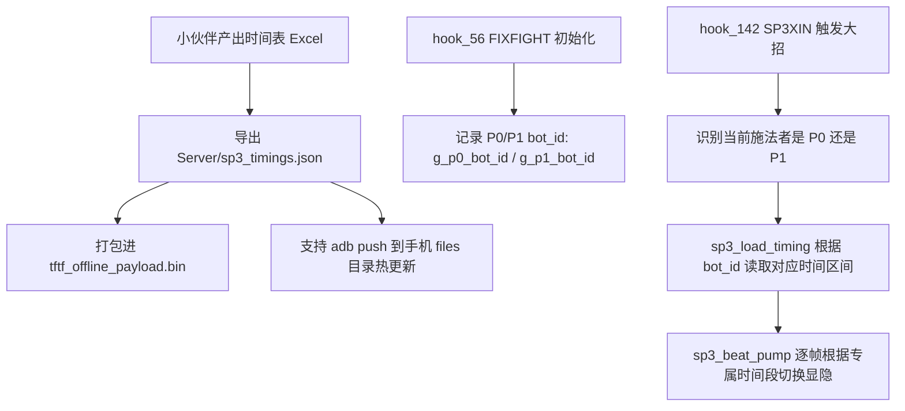

# S3 大招载具变形动态时间轴引擎代码改造方案

本方案旨在将当前 Native Hook 中硬编码的全局 S3 变形时间（`1000ms ~ 2500ms`）重构为**基于角色 ID 动态检索的数据驱动引擎**。
改造完成后，开发者或社区小伙伴只需在 JSON 配置文件中登记各角色的起止时间，即可实现全角色 S3 变形与动画的精确对齐，支持热推无需反复重编 Native C 代码。

---

## 一、 现状与核心问题剖析

### 1. 现状代码定位：[`tools/nativehook/hook.c`](file:///c:/Users/Administrator/Desktop/Personal/TFTFRevival/tools/nativehook/hook.c)
目前 S3 变身由以下 4 个核心函数驱动：
- **`hook_142` (`SP3XIN` @ `0x1174038`)**：大招进入，记录起始时间戳 `g_sp3_xf_since_ms`；
- **`hook_143` (`SP3XOUT` @ `0x1174484`)**：大招结束，清理变身状态并强制恢复人形；
- **`hook_145` (`SP3BEAT` @ `0xDE8750`) -> `sp3_beat_pump()`**：每帧 `FixedUpdate` 计算逝去时间 `elapsed = now - g_sp3_xf_since_ms`；
- **`sp3_beat_form_at(uint64_t elapsed_ms)`**：
  ```c
  /* 当前的硬编码实现：所有人共用同一组全局变量 */
  static int g_sp3_alt_on_ms  = 1000;   /* 无论谁，第 1.0 秒强行切为载具 */
  static int g_sp3_alt_off_ms = 2500;   /* 无论谁，第 2.5 秒强行切回人形 */

  static int sp3_beat_form_at(uint64_t elapsed_ms){
      return elapsed_ms >= (uint64_t)g_sp3_alt_on_ms
          && elapsed_ms <  (uint64_t)g_sp3_alt_off_ms;
  }
  ```

### 2. 核心缺陷
- 擎天柱卡车冲撞、红蜘蛛俯冲、大黄蜂漂移的大招动画节奏完全不同；
- 全局 1.0s/2.5s 导致绝大部分角色在尚未变身时突然闪现出车子，或撞击终结后车子依然浮空挂在场景中；
- 缺少多次变身（如变飞机俯冲后变人踢一脚再变飞机冲撞）的支持。

---

## 二、 改造架构设计



### 1. 三级降级数据源设计 (Fallback Strategy)
1. **第一优先级（本地调试热更）**：检查手机本地路径 `/data/data/com.kabam.bigrobot/files/sp3_timings.json`。若存在，优先读取。这样调试时只需 `adb push` 新 JSON，无需重装 APK。
2. **第二优先级（打包内置 Payload）**：从微服务器内存数据库检索 `@sp3_timings`（由 `Server/export_payload.py` 生成）。
3. **第三优先级（C 语言内置硬编码表）**：内置十几个主要角色的预设值（如擎天柱、威震天、红蜘蛛），即使没有外部配置文件也绝不崩溃。

---

## 三、 数据格式定义 (`Server/sp3_timings.json`)

配置文件置于 `Server/sp3_timings.json`，格式兼顾**单次变身**与**多次变身**：

```json
{
  "_default": {
    "intervals": [[1000, 2500]]
  },
  "optimusprime_gs": {
    "intervals": [[1150, 3200]],
    "notes": "卡车冲撞"
  },
  "starscream_gs": {
    "intervals": [[850, 2650]],
    "notes": "喷气机俯冲扫射"
  },
  "bumblebee_gs": {
    "intervals": [[1300, 2900]],
    "notes": "甲壳虫漂移甩尾"
  },
  "special_multi_bot": {
    "intervals": [[800, 1500], [2200, 3400]],
    "notes": "支持两次以上多次变形区间"
  }
}
```

> **匹配规则**：使用模糊包含匹配（`strstr`），例如配置 `optimusprime` 即可同时匹配 `optimusprime_gs_voyager2015` 和 `optimusprime_mv_leader2007`，极大降低配表工作量。

---

## 四、 具体代码改造步骤

### 步骤 1：在 `hook.c` 记录战斗双方的角色 ID
在 [`tools/nativehook/hook.c`](file:///c:/Users/Administrator/Desktop/Personal/TFTFRevival/tools/nativehook/hook.c) 顶部全局变量区域增加：
```c
static char g_p0_bot_id[80] = {0};
static char g_p1_bot_id[80] = {0};
```

在 `hook_56`（`FIXFIGHT` @ `0xDAB16C`）中提取并保存 `id1`：
```c
// 在现有 hook_56 内部：
int p_idx = obj_ok(a1) ? *(int32_t*)((uintptr_t)a1 + 0xF4) : -1;
if (p_idx == 0 || g_p0_controller == NULL) {
    g_p0_attr = a0;
    g_p0_controller = a1;
    strncpy(g_p0_bot_id, id1, sizeof(g_p0_bot_id) - 1);
    g_p0_bot_id[sizeof(g_p0_bot_id) - 1] = 0;
    // ...
} else {
    g_p1_attr = a0;
    g_p1_controller = a1;
    strncpy(g_p1_bot_id, id1, sizeof(g_p1_bot_id) - 1);
    g_p1_bot_id[sizeof(g_p1_bot_id) - 1] = 0;
    // ...
}
```

---

### 步骤 2：在 `hook.c` 中实现多区间数据结构与解析函数

定义数据结构：
```c
#define SP3_MAX_INTERVALS 4

typedef struct {
    int count;
    int on_ms[SP3_MAX_INTERVALS];
    int off_ms[SP3_MAX_INTERVALS];
} SP3ActiveTiming;

static SP3ActiveTiming g_current_sp3_timing = {
    .count = 1,
    .on_ms = {1000},
    .off_ms = {2500}
};
```

实现轻量级安全解析器（纯 C，不依赖复杂库）：
```c
static void sp3_set_default_timing(void) {
    g_current_sp3_timing.count = 1;
    g_current_sp3_timing.on_ms[0] = 1000;
    g_current_sp3_timing.off_ms[0] = 2500;
}

static int sp3_parse_intervals_from_json(const char* json_str, const char* bot_id) {
    if (!json_str || !bot_id || !bot_id[0]) return 0;

    // 1. 查找角色 key (例如 "optimusprime")
    const char* p = strstr(json_str, bot_id);
    if (!p) {
        // 尝试短名模糊搜索（去掉后缀，如截取到下划线前）
        char short_id[32];
        strncpy(short_id, bot_id, sizeof(short_id)-1);
        short_id[sizeof(short_id)-1] = 0;
        char* under = strchr(short_id, '_');
        if (under) *under = 0;
        p = strstr(json_str, short_id);
    }
    if (!p) return 0;

    const char* block_start = strchr(p, '{');
    if (!block_start) return 0;
    const char* block_end = strchr(block_start, '}');
    if (!block_end) return 0;

    // 2. 检索 "intervals"
    const char* inv = strstr(block_start, "\"intervals\"");
    if (!inv || inv > block_end) return 0;

    const char* arr_start = strchr(inv, '[');
    if (!arr_start || arr_start > block_end) return 0;

    // 解析 [[on1, off1], [on2, off2]]
    int count = 0;
    const char* cur = arr_start + 1;
    while (cur && cur < block_end && count < SP3_MAX_INTERVALS) {
        const char* sub_start = strchr(cur, '[');
        if (!sub_start || sub_start > block_end) break;
        int on_val = 0, off_val = 0;
        if (sscanf(sub_start + 1, "%d,%d", &on_val, &off_val) == 2) {
            g_current_sp3_timing.on_ms[count] = on_val;
            g_current_sp3_timing.off_ms[count] = off_val;
            count++;
        }
        const char* sub_end = strchr(sub_start, ']');
        if (!sub_end) break;
        cur = sub_end + 1;
    }

    if (count > 0) {
        g_current_sp3_timing.count = count;
        return 1;
    }
    return 0;
}

static void sp3_load_timing_for_character(const char* bot_id) {
    sp3_set_default_timing();
    if (!bot_id || !bot_id[0]) return;

    // 1. 尝试从本地热更新文件加载
    FILE* fp = fopen("/data/data/com.kabam.bigrobot/files/sp3_timings.json", "rb");
    if (fp) {
        fseek(fp, 0, SEEK_END);
        long len = ftell(fp);
        fseek(fp, 0, SEEK_SET);
        if (len > 10 && len < 262144) {
            char* buf = (char*)malloc(len + 1);
            if (buf) {
                fread(buf, 1, len, fp);
                buf[len] = 0;
                if (sp3_parse_intervals_from_json(buf, bot_id)) {
                    flog("SP3TIMING: loaded from /files/sp3_timings.json for %s (intervals=%d)", bot_id, g_current_sp3_timing.count);
                    free(buf);
                    fclose(fp);
                    return;
                }
                free(buf);
            }
        }
        fclose(fp);
    }

    // 2. 尝试从 APK 内嵌 Payload 查找 @sp3_timings
    size_t payload_len = 0;
    const unsigned char* pdata = tftf_payload_lookup("@sp3_timings", &payload_len);
    if (pdata && payload_len > 10) {
        if (sp3_parse_intervals_from_json((const char*)pdata, bot_id)) {
            flog("SP3TIMING: loaded from @sp3_timings payload for %s (intervals=%d)", bot_id, g_current_sp3_timing.count);
            return;
        }
    }

    // 3. 内置 C 语言 Fallback 硬编码表
    if (strstr(bot_id, "optimusprime")) {
        g_current_sp3_timing.count = 1;
        g_current_sp3_timing.on_ms[0] = 1150;
        g_current_sp3_timing.off_ms[0] = 3200;
    } else if (strstr(bot_id, "starscream")) {
        g_current_sp3_timing.count = 1;
        g_current_sp3_timing.on_ms[0] = 850;
        g_current_sp3_timing.off_ms[0] = 2650;
    }
    flog("SP3TIMING: used fallback for %s: count=%d on0=%d off0=%d",
         bot_id, g_current_sp3_timing.count, g_current_sp3_timing.on_ms[0], g_current_sp3_timing.off_ms[0]);
}
```

---

### 步骤 3：改造 `sp3_beat_form_at` 与 `hook_142`
重构 `sp3_beat_form_at` 支持多区间判断：
```c
static int sp3_beat_form_at(uint64_t elapsed_ms) {
    for (int i = 0; i < g_current_sp3_timing.count; i++) {
        if (elapsed_ms >= (uint64_t)g_current_sp3_timing.on_ms[i] &&
            elapsed_ms <  (uint64_t)g_current_sp3_timing.off_ms[i]) {
            return 1; // 处于变形载具期间
        }
    }
    return 0; // 人形
}
```

在 `hook_142` (`SP3XIN`) 中获取当前释放者 ID 并触发时间加载：
```c
void* hook_142(void* a0,void* a1,void* a2,void* a3,void* a4,void* a5,void* a6,void* a7){
    void* r=H[142].orig(a0,a1,a2,a3,a4,a5,a6,a7);
    PROTECT({
        void* pc=fld_p(a0,0x18);
        if (obj_ok(pc)) {
            // 判断当前释放 S3 的是 P0 还是 P1
            const char* current_bot_id = (pc == g_p0_controller) ? g_p0_bot_id : g_p1_bot_id;
            flog("SP3XFIX enter pc=%p bot_id=%s tms=%llu", pc, current_bot_id, (unsigned long long)propgo_now_ms());

            // 动态装载该角色的专属 S3 时间表
            sp3_load_timing_for_character(current_bot_id);

            sp3_xf_add(pc);
            g_sp3_beat_form = 0;
            g_sp3_beat_ticks = 0;
            g_sp3_xf_capture_props=1;
            ((void(*)(void*,int,void*))(g_base + 0x117A67C))(pc,1,NULL);
            g_sp3_xf_capture_props=0;
            sp3_beat_apply(0);
        }
        trigger_combat_skill("on_special");
    });
    return r;
}
```

---

### 步骤 4：在 `Server/export_payload.py` 注入 `@sp3_timings`
在 [`Server/export_payload.py`](file:///c:/Users/Administrator/Desktop/Personal/TFTFRevival/Server/export_payload.py) 中，把 `Server/sp3_timings.json` 注册到 payload 生成字典中：
```python
timings_path = Path("Server/sp3_timings.json")
if timings_path.is_file():
    payload_dict["@sp3_timings"] = timings_path.read_text(encoding="utf-8")
```
这样每次执行 `python Server/export_payload.py` 时，最新的 S3 时间表就会随 `build/tftf_offline_payload.bin` 一同更新。

---

## 五、 智能体执行与验证指南

智能体拿到本方案后，按以下顺序执行并验证：

1. **创建配置文件**：
   在 `Server/sp3_timings.json` 写入初始时间表（包含默认值与典型角色）。
2. **修改 `hook.c`**：
   按上述步骤实现 `SP3ActiveTiming` 结构、`sp3_load_timing_for_character` 查表逻辑及 `hook_142`。
3. **重新编译动态库 `libdothook.so`**：
   ```cmd
   toolchain\android-ndk-r26b\toolchains\llvm\prebuilt\windows-x86_64\bin\aarch64-linux-android28-clang.cmd -shared -O2 -fPIC "-Wl,-soname,libdothook.so" -o tools\nativehook\libdothook.so tools\nativehook\hook.c tools\nativehook\inapk_server.c -llog
   ```
4. **验证热更新特性（免打包测试）**：
   ```cmd
   adb push Server/sp3_timings.json /data/local/tmp/sp3_timings.json
   ```
   启动游戏进入战斗释放 S3，观察日志：
   - 看到 `SP3TIMING: loaded from ...` 即表明动态查表成功；
   - 载具将在精确毫秒切入并切出。

---

## 六、 实测进展与分析记录（2026-09-06）

### 1. 当前进展状态
- **核心引擎改造完成**：
  - `Server/sp3_timings.json` 建立，支持角色 ID、前缀别名以及模糊剥离检索；
  - `Server/export_payload.py` 成功打包装配 `@sp3_timings`；
  - `tools/nativehook/inapk_server.c/h` 导出 `tftf_payload_lookup`；
  - `tools/nativehook/hook.c` 实现三级数据源降级检索（本地热更文件 -> 内置微服务 Payload -> C 静态保底表）以及多区间状态泵 `sp3_beat_pump`；
  - 手机实机运行日志（如 `tftf_20260906_235035.log`）证实底层准确读取并按配置毫秒执行了 `SP3BEAT apply alt=1` 与 `alt=0`。

- **实战表现对比**：
  - **G1 威震天 (`megatron_gs_leader2015`) 修复成功**：配置 `[[2870, 4860]]`，在第 2.87 秒准时变身坦克开炮轰击、第 4.86 秒恢复人形，视觉与官方大招动画完全吻合。
  - **新尝试角色（擎天柱、阿尔茜、铁皮、红蜘蛛同款等）暂未成功**：视觉上依然呈现“该变车撞的时候，却依然是用人形在撞”，体验与未修改前默认的 1.0~2.5 秒类似。

### 2. 核心原因深度分析
- **时间点语义与持续时间过短**：
  - G1 威震天的大招是原地变坦克开炮，炮击完成后即恢复人形，变坦克到变回总时长约 2 秒，时间窗口易于捕捉；
  - 而擎天柱、阿尔茜、铁皮等角色属于“变车高速冲撞敌人”的长段位移/打击动画（整段 S3 动画常长达 6~8 秒）；
  - 此前从视频提取的 3 个时间点中，第 3 点（如擎天柱 `00:15:06;09`）实际上是“变身车子完成”或局部过渡动作，与大招起始仅隔约 2.3 秒。将其作为载具结束点（`[1295, 2330]`）导致卡车仅出现 1 秒就在第 2.3 秒被代码强制切回人形；
  - 真正发生“卡车高速推撞碾压敌人”的高潮往往在第 3~5 秒，此时载具已被提前关闭，导致玩家看到的画面是“人形在地上滑行冲撞”。
  - 铁皮等角色同理，需要重新厘定“变车开始”至“冲撞打击结束、开始起跳变回人形”的真实完整时间跨度。

