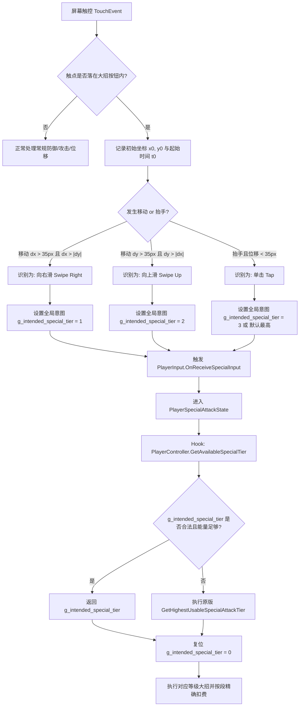

# TFTF 特殊技与能量槽资源管理优化方案设计与技术实施指南

本文档完整记录了针对《变形金刚：百炼为战》（Transformers: Forged to Fight，简称 TFTF）战斗能量系统与特殊技（大招）释放机制的用户需求、底层逆向分析过程、技术结论以及面向开发实施落地的完整技术方案。

后续接入此任务的开发者或 AI 智能体可依据本文档直接推进编码实施。

---

## 目录
1. [背景与需求定义](#一背景与需求定义)
2. [操作交互选型与评估](#二操作交互选型与评估)
3. [底层引擎与汇编级逆向分析](#三底层引擎与汇编级逆向分析)
4. [核心技术结论](#四核心技术结论)
5. [系统实现方案与架构设计](#五系统实现方案与架构设计)
6. [分步实施代码指南 (Native C Hook)](#六分步实施代码指南-native-c-hook)
7. [编译构建与实机验证指南](#七编译构建与实机验证指南)

---

## 一、 背景与需求定义

### 1. 原版游戏痛点
在 TFTF 原版战斗机制中，大招释放逻辑采用“**贪心扣费制**”：
- 当能量槽大于等于 1 格且不足 2 格时，点击大招按钮释放 **SP1**（消耗 1 格气）；
- 当能量槽大于等于 2 格且不足 3 格时，点击大招按钮释放 **SP2**（消耗 2 格气）；
- 当能量槽达到 3 格满气时，能量槽不再继续积攒，此时点击大招按钮**锁死只能释放 SP3**（消耗全部 3 格气）。

**现实格斗场景冲突**：
在主流格斗游戏（如《街头霸王》、《拳皇》）中，能量（Super Meter）是非常关键的博弈资源管理要素。在 TFTF 中：
1. **很多角色的 SP3 并非战局最优解**：例如某些角色的 SP2 具有更强力的破甲、高伤连击或强控制效果，或者 SP1 具有高频净化/打断效果；
2. **满气被动僵局**：一旦攒满 3 格气，玩家为了不浪费后续的怒气获取，被迫必须打出 SP3，无法在满气状态下灵活选择“先放一个 SP1 试探/打断（消耗1格，剩余2格），再择机放 SP2”。

### 2. 用户优化诉求
参考主流格斗游戏资源管理机制，在玩家拥有 3 格气（甚至 2 格气）时，不锁死招式等级，允许玩家通过特定输入主动选择释放 SP1、SP2 或 SP3：
- 满 3 格气时释放 SP1：消耗 1 格气，**剩余 2 格气**继续保留并可继续使用；
- 满 3 格气时释放 SP2：消耗 2 格气，**剩余 1 格气**继续保留并可继续使用；
- 满 3 格气时释放 SP3：消耗 3 格气。

---

## 二、 操作交互选型与评估

针对移动端触屏输入的特性，用户与开发者探讨了三种主要候选交互方案：

### 候选方案对比表

| 方案 | 交互方式 | 肌肉记忆兼容 | 防误触表现 | 平板/大屏适配 | 综合评价 |
| :--- | :--- | :---: | :---: | :---: | :---: |
| **方案 A（推荐）** | **大招按钮滑动定向**<br>· 单击 (Tap) = 释放当前最高可用 (SP3)<br>· 向右滑 (Swipe Right) = 强制释放 SP1<br>· 向上滑 (Swipe Up) = 强制释放 SP2 | **100% 保持**<br>默认点击完全不改 | **极高**<br>手势起点锁定在按钮内 | **极佳**<br>大拇指原地微动，无需长位移 | **最优解**<br>手感最丝滑，逻辑自洽 |
| **方案 B** | **视觉气槽按三段点击**<br>将横向气槽物理分割为 3 个可点击热区，点哪格放哪个大招 | **差**<br>颠覆原有按键习惯 | **低**<br>气槽极细(30~50px)，极易点空 | **极差**<br>平板双手握持时拇指触碰不到远端 | **淘汰**<br>激烈战斗中无法盲操 |
| **方案 C** | **大招按钮周边盲区点击**<br>· 点击按钮 = SP3<br>· 点击按钮上方 = SP2<br>· 点击按钮右方 = SP1 | **差**<br>无视觉边框提示 | **极差（致命）**<br>按钮上方是左屏“按住防御”的黄金区 | **一般** | **淘汰**<br>严重破坏核心防御机制 |

### 选定方案 A 的设计细节
1. **默认行为保护（零学习成本）**：常规直接点击大招按钮（Tap），依然执行原版贪心逻辑（3格出SP3，2格出SP2，1格出SP1），完全保留老玩家多年形成的肌肉记忆。
2. **手势防误触保障**：手势检测的起始点（`TouchPhase.Began`）**必须严格落在大招按钮碰撞体（Collider）内**。用户在屏幕左侧空白处长按防御、快速向右划滑动闪避（Evade/Dash）时，因为触点起始不在按钮内，绝对不会误触发大招手势。
3. **视觉心理隐喻直觉**：
   - 气槽本身是从大招按钮向右侧横向延展的：向右划动（Swipe Right）直观对应“推向第 1 格气”；
   - 向上划动（Swipe Up）直观对应“进阶/提升一档”（释放 SP2）。
4. **容错与回退**：若当前只有 1 格气却执行了向上划动（试图放 SP2），底层安全逻辑会自动将其降级释放 SP1 或视为指令无效，绝不卡死。

---

## 三、 底层引擎与汇编级逆向分析

通过对游戏 Android 64 位核心动态库 `libil2cpp.so`（基准版本 9.2.0，ARM64）及 `global-metadata.dat`（版本 27）的深度逆向分析，全面复盘了战斗中大招触发与扣费的底层链路。

### 1. 完整执行调用链

```
[UI 触摸事件]
  │
  ▼
HudSpecialMeter.OnSpecialButtonPressed() (RVA 0xff05c8)
  │  派发委托 OnSpecialButtonClicked
  ▼
HudScreen.PlayerSpecialButtonClicked() (RVA 0xc01078)
  │
  ▼
PlayerInput.OnReceiveSpecialInput() (RVA 0x1180eb8)
  │  设置当前缓冲动作: QueuedAction.SetAction(this, 0x200) (Action.SpecialAttack)
  ▼
PlayerInput.Simulate() (RVA 0x1180f88)
  │  每帧轮询: 若 HasAction() 为真，调用 ExecuteAction(0x200)
  ▼
PlayerController.Action(int action=0x200) (RVA 0x1179af4)
  │  状态机切换: 转入大招蓄力/就绪状态
  ▼
PlayerSpecialAttackState.OnEnter() (RVA 0xe339d8)
  │  0xe339c0: bl 0x1173fa4 (PlayerController.GetAvailableSpecialTier)
  │  0xe339c8: str w0, [x19, #0x34]  <--- 关键！在此处锁定了本轮大招的释放等级 (1, 2, 3)
  ▼
PlayerController.SpecialAttack(int index) (RVA 0x1174300)
  │  0x117438c: b 0xdacf14 (PlayerPowerMeter.ConsumeSpecialPower)
  ▼
PlayerPowerMeter.ConsumeSpecialPower(int index) (RVA 0xdacf14)
```

---

### 2. 能量扣减汇编逻辑（证明原生支持阶梯扣费）

反汇编 `PlayerPowerMeter.ConsumeSpecialPower`（RVA `0xdacf14`）：

```arm64
  dacf14: str   x21, [sp, #-0x30]!
  dacf24: mov   w19, w1            // w19 = 传入的目标大招等级 index (1, 2, 3)
  dacf28: mov   x21, x0            // x21 = PlayerPowerMeter 实例指针
  dacf2c: bl    0xdace1c           // 调用 CanUseSpecial(index) 校验是否可用
  dacf30: tbz   w0, #0x0, 0xdacf5c // 若不能释放，直接返回 0 (false)
  dacf34: ldr   x20, [x21, #0x70]  // x20 = 能量属性对象指针 (Power Attribute)
  dacf44: bl    0xe2ff20           // 获取当前能量值: float current_power (返回在 s0)
  dacf48: ldr   x8, [x21, #0x58]   // x8 = 能量配置对象
  dacf50: ldr   s1, [x8, #0x28]    // s1 = 最大格数 max_bars (int 转换为 float，默认为 3.0)
  dacf54: scvtf s1, s1
  dacf68: scvtf s2, w19            // s2 = (float)index (即 1.0, 2.0, 3.0)
  dacf6c: fdiv  s1, s2, s1         // s1 = index / max_bars (即消耗比例: 1/3, 2/3, 3/3)
  dacf70: fsub  s0, s0, s1         // s0 = current_power - s1 (剩余能量)
  dacf74: mov   x0, x20
  dacf7c: bl    0xe2ff70           // 调用 SetCurrentPower(s0) 保存新能量值！
  dacf80: orr   w0, wzr, #0x1      // 返回 true (成功)
  dacf90: ret
```

**汇编级事实**：
- 游戏底层的扣费公式硬编码为：`RemainingPower = CurrentPower - (index / 3.0)`。
- **只要传入 `index = 1`，底层就只会扣除 `0.3333`（1 格气），绝不会将剩余能量清零！**
- 满 3 格气（`CurrentPower = 1.0`）时调用 `SpecialAttack(1)`，执行完毕后系统内实打实剩余 `0.6666`（2 格气），HUD 会继续显示 2 格黄条，后续系统行为毫无违和感。

---

### 3. 原版“锁死出最高”的根源定位

反汇编 `PlayerPowerMeter.GetHighestUsableSpecialAttackTier`（RVA `0xdacdc4`）：

```arm64
  dacdd0: ldr   x8, [x0, #0x58]
  dacddc: ldr   w19, [x8, #0x28]   // w19 = max_bars (从 3 开始倒序)
  dacdf0: mov   x0, x20
  dacdf4: mov   w1, w19            // w1 = 当前探测等级 (3 -> 2 -> 1)
  dacdf8: bl    0xdace1c           // 调用 CanUseSpecial(w1)
  dacdfc: tbnz  w0, #0x0, 0xdace0c // 只要当前能量足够释放 w1，立即跳出并返回 w1！
  dace00: subs  w19, w19, #0x1     // 否则等级递减 (3 降到 2，2 降到 1)
  dace04: b.gt  0xdacdf0           // 循环直到找到或结束
  dace08: mov   w19, wzr           // 都不满足则返回 0
  dace0c: mov   w0, w19
  dace18: ret
```

**原因定性**：
原版在进入大招状态时，调用了 `GetAvailableSpecialTier()`，该函数内部无脑调用上述循环贪心算法，导致“**有 3 格必返回 3，有 2 格必返回 2**”。只要我们在此处进行劫持，根据玩家的输入意图返回指定的 `index`（1 或 2），整个战斗系统便会自然进入对应的招式！

---

## 四、 核心技术结论

1. **引擎原生兼容性**：100% 完美支持资源管理。无需重写战斗状态机、动作播放器或能量衰减公式。
2. **核心改动缝隙（Seam）明确**：
   - **输入采集层**：在大招按钮上监听触控滑动向量，识别玩家意向目标等级（`target_tier = 1, 2, 3`）；
   - **逻辑决议层**：在 `PlayerController.GetAvailableSpecialTier`（RVA `0x1173fa4`）处进行拦截改写。若玩家有特定意图且能量满足，直接返回对应意图等级，否则回退原版贪心逻辑。

---

## 五、 系统实现方案与架构设计

### 1. 架构流程图



---

## 六、 分步实施代码指南 (Native C Hook)

所有改动集中于 Native Hook 框架：[`tools/nativehook/hook.c`](file:///c:/Users/Administrator/Desktop/Personal/TFTFRevival/tools/nativehook/hook.c)。

### 步骤 1：定义全局意图状态与滑动检测上下文

在 `hook.c` 顶部静态变量区域添加：

```c
// ==================== 大招资源管理手势状态机 ====================
static int g_intended_special_tier = 0;  // 0: 默认最高, 1: 强制SP1, 2: 强制SP2, 3: 强制SP3
static int g_sp_touch_tracking = 0;
static float g_sp_touch_start_x = 0.0f;
static float g_sp_touch_start_y = 0.0f;
static uint64_t g_sp_touch_start_ms = 0;

#define SP_SWIPE_MIN_DISTANCE_PX 35.0f // 滑动判定的最小像素阈值
```

---

### 步骤 2：拦截大招招式等级决议 (`GetAvailableSpecialTier`)

定位到 `PlayerController.GetAvailableSpecialTier`（RVA `0x1173fa4`）。
在 `H[]` 表中注册该钩子（假设分配槽位 `153`）：

```c
// 在 struct H[] 数组中增加：
{ 0x1173FA4, "PCGETSPTIER", 2, 0 }, // 153 PlayerController.GetAvailableSpecialTier
```

实现 `hook_153`：

```c
void* hook_153(void* self, void* a1, void* a2, void* a3, void* a4, void* a5, void* a6, void* a7) {
    // 只有玩家操控的角色 (P0) 才应用手动资源选择逻辑，AI (P1) 保持原样
    if (self == g_p0_controller && obj_ok(g_p0_controller)) {
        if (g_intended_special_tier > 0) {
            int desired = g_intended_special_tier;
            g_intended_special_tier = 0; // 消费意图，单次有效

            // 获取 PlayerPowerMeter 实例指针 (PlayerController + 0x80)
            void* power_meter = *(void**)((uintptr_t)self + 0x80);
            if (obj_ok(power_meter)) {
                // 调用 CanUseSpecial(power_meter, desired) @ RVA 0xDACE1C
                typedef int (*fn_can_special)(void*, int);
                fn_can_special can_use = (fn_can_special)(g_base + 0xDACE1C);
                if (can_use(power_meter, desired)) {
                    flog("RESOURCE_MGMT: Overriding special attack tier -> %d (player requested)", desired);
                    return (void*)(intptr_t)desired;
                } else {
                    flog("RESOURCE_MGMT: Desired tier %d not affordable, fallback to stock logic", desired);
                }
            }
        }
    }
    // 默认或后备：走原版降序贪心流程
    return H[153].orig(self, a1, a2, a3, a4, a5, a6, a7);
}
```

---

### 步骤 3：手势解析与大招意图注入

**方式：挂钩 `HudSpecialMeter.OnSpecialButtonPressed` (RVA `0xFF05C8`)**
通过在 UI 交互层识别手势。在移动设备上，Unity 的 `UnityEngine.Input.touches` 或 NGUI 传递的当前触摸位置可通过原生或者 Unity 导出的接口获取。

对于 Native Hook，最轻量级且稳定的做法是：
在 NGUI 的触控输入通道（或全局触摸处理）中，获取按键被触发时的滑动偏量：

```c
// 示例：在 HudSpecialMeter.OnSpecialButtonPressed 或触摸分发点注入
void record_special_gesture(float delta_x, float delta_y) {
    if (delta_x > SP_SWIPE_MIN_DISTANCE_PX && delta_x > fabsf(delta_y)) {
        g_intended_special_tier = 1; // 向右滑 -> SP1
        flog("GESTURE: Swipe Right detected -> Intend SP1");
    } else if (delta_y > SP_SWIPE_MIN_DISTANCE_PX && delta_y > fabsf(delta_x)) {
        g_intended_special_tier = 2; // 向上滑 -> SP2
        flog("GESTURE: Swipe Up detected -> Intend SP2");
    } else {
        g_intended_special_tier = 0; // 单击 -> 默认最高可用 (SP3)
        flog("GESTURE: Tap detected -> Intend Max Available");
    }
}
```

---

## 七、 编译构建与实机验证指南

必须严格遵守项目标准的编译流水线（遵守 [`AGENTS.md`](file:///c:/Users/Administrator/Desktop/Personal/TFTFRevival/AGENTS.md) 规则，严防对齐与 Patch 缺失踩坑）：

### 1. 重新编译 Native Hook
```cmd
toolchain\android-ndk-r26d\toolchains\llvm\prebuilt\windows-x86_64\bin\aarch64-linux-android28-clang.cmd -shared -O2 -fPIC "-Wl,-soname,libdothook.so" -o tools\nativehook\libdothook.so tools\nativehook\hook.c tools\nativehook\inapk_server.c -llog
```

### 2. 组装未签名 APK
```cmd
python Server\build_phone_apk.py "com.kabam.bigrobot_9.2.0-123129100_minAPI23(arm64-v8a,armeabi-v7a)(nodpi)_apkmirror.com.apk" "build\unsigned.apk" --scheme http --server-host 127.0.0.1 --server-port 8080 --bundle-server --patched-il2cpp "build\libil2cpp-arm64-patched.so"
```
> [!CRITICAL]
> 必须传递 `--patched-il2cpp "build\libil2cpp-arm64-patched.so"`，以确保 `libdothook.so` 依赖注入，否则离线服务器无法在应用启动时初始化。

### 3. 执行 4KB 页面对齐 (`zipalign`)
```cmd
toolchain\android-13\zipalign.exe -f -p 4 build\unsigned.apk build\aligned.apk
```

### 4. 签名并输出最终 APK
```cmd
toolchain\android-13\apksigner.bat sign --ks build\debug.keystore --ks-pass pass:android --out build\Transformers-9.2-offline-redeco-edition.apk build\aligned.apk
del build\unsigned.apk build\aligned.apk
```

---

### 5. 验证检查清单 (Verification Checklist)

进入战斗后，开启 `adb logcat -s TFTFHOOK` 观察输出：

1. **测试用例 1：满 3 格气释放 SP1**
   - **操作**：在大招按钮上向右滑动。
   - **预期现象**：
     - 日志输出 `RESOURCE_MGMT: Overriding special attack tier -> 1 (player requested)`。
     - 角色播放 SP1 动作与特效。
     - 动作结束后，黄色能量槽如实**保留整整 2 格能量**，未被清空。
2. **测试用例 2：满 3 格气释放 SP2**
   - **操作**：在大招按钮上向上滑动。
   - **预期现象**：
     - 日志输出 `RESOURCE_MGMT: Overriding special attack tier -> 2 (player requested)`。
     - 角色播放 SP2 动作。
     - 动作结束后，黄色能量槽**保留整整 1 格能量**。
3. **测试用例 3：常规单击释放 SP3**
   - **操作**：直接单击大招按钮。
   - **预期现象**：
     - 日志输出默认最大等级流程，正常进入电影大招（Cinematic SP3），消耗全部 3 格能量。
4. **测试用例 4：防误触验证**
   - **操作**：在左半屏长按防御、在左半屏滑动撤步闪避。
   - **预期现象**：
     - 正常执行防御与撤步，绝不误触大招。
