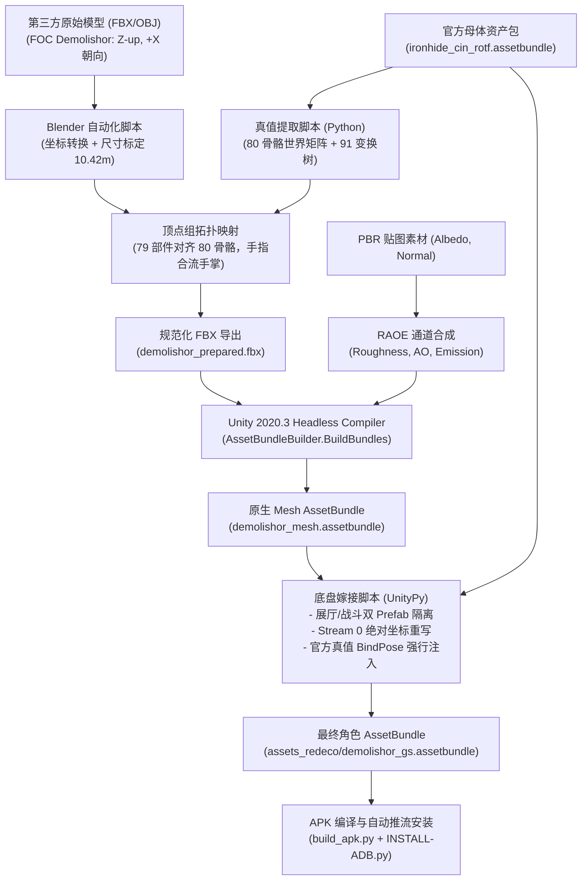

# 《TFTF 第三方 3D 模型导入与骨骼蒙皮全自动化管线指南》
## Complete Engineering Specification: 3rd-Party 3D Model Ingestion, Skeleton Retargeting, and AssetBundle Grafting in Transformers: Forged to Fight

> **文档版本**：v1.0 (Revival Production Edition)  
> **适用引擎**：Unity 5.5.x / 5.6.x (游戏底版运行时) & Unity 2020.3.x LTS (工具链网格编译器)  
> **面向对象**：在不同机器上执行新角色 3D 移植的自主智能体（AI Agent）与逆向工程开发者  
> **典型成功案例**：塞伯坦陨落（Fall of Cybertron）重装霸天虎 **破坏者（Demolishor）** 移植到电影版铁皮（Movie Ironhide `ironhide_cin_rotf`）母体

---

## 目录
1. [管线架构与核心原理 (Architecture & Principles)](#1-管线架构与核心原理)
2. [开发环境与工具链自动化部署 (Toolchain Setup)](#2-开发环境与工具链自动化部署)
3. [Unity 账户激活与无头编译配置 (Unity Licensing & Headless Build)](#3-unity-账户激活与无头编译配置)
4. [全流程模型制作与资产嫁接 (End-to-End Asset Pipeline)](#4-全流程模型制作与资产嫁接)
   * 4.1 母体骨骼真值与层级树逆向提取
   * 4.2 空间坐标系变换与轴向重映射
   * 4.3 顶点组语义映射与拓扑折叠（消除手指炸裂）
   * 4.4 PBR 贴图转码与 RAOE 通道烘焙
   * 4.5 角色头像（Portrait）占位与工业化工作流规范
   * 4.6 Unity 无头编译生成原生网格 AssetBundle
   * 4.7 跨 Prefab 物理隔离与 BindPose 注入嫁接
   * 4.8 服务端注册与客户端 Hook 接入
5. [常见故障排查与已结案死胡同 (Troubleshooting & Settled Dead Ends)](#5-常见故障排查与已结案死胡同)
6. [一键执行与后续角色复用模板 (Reusable Automation Scripts)](#6-一键执行与后续角色复用模板)

---

## 1. 管线架构与核心原理

### 1.1 问题定义
TFTF 原版游戏包含上百个高质量的角色动画与特技动作树（`moves.assetbundle`），但原生角色数量受限。本管线的核心目标是：**将任意第三方标准 3D 模型（如主机游戏 FOC、SFM、Sketchfab 的 FBX/OBJ）无缝嫁接进 TFTF 官方角色的骨架上，使其完美继承官方的高精战斗动作、连招判定、展厅待机与技能特效，同时在 Android 端以 60 FPS 稳定运行，无崩溃、无渲染畸变。**



### 1.2 GPU 骨骼蒙皮关键数学约束（Linear Blend Skinning, LBS）
Unity 的 GPU 顶点蒙皮遵循以下刚性变换公式：
$$\mathbf{v}_{\text{world}} = \sum_{i=1}^{k} w_i \cdot \left( \mathbf{M}_{\text{bone}_i}^{\text{anim}} \cdot \mathbf{B}_i \right) \cdot \mathbf{v}_{\text{mesh}}$$
* $\mathbf{v}_{\text{mesh}}$：网格顶点在 Mesh Stream 0 中的局部静止坐标；
* $\mathbf{B}_i$：存储在网格 `m_BindPose` 数组中的**绑定姿态逆矩阵（Inverse Bind Matrix）**；
* $\mathbf{M}_{\text{bone}_i}^{\text{anim}}$：动画系统当前帧为骨骼 $i$ 计算的世界变换矩阵；
* $w_i$：顶点对骨骼 $i$ 的归一化权重（$\sum w_i = 1.0$）。

> **【黄金恒等律】**：  
> 若要保证模型在初始绑定姿态下**没有任何形变、拉扯或漂移**，则当前骨骼在静止姿态的世界矩阵 $\mathbf{M}_i^{\text{rest}}$ 与其逆绑定矩阵 $\mathbf{B}_i$ 的乘积必须恒等于单位矩阵：
> $$\mathbf{M}_i^{\text{rest}} \cdot \mathbf{B}_i \equiv \mathbf{I} = \begin{bmatrix} 1 & 0 & 0 & 0 \\ 0 & 1 & 0 & 0 \\ 0 & 0 & 1 & 0 \\ 0 & 0 & 0 & 1 \end{bmatrix}$$
> 本管线的所有对齐脚本均经过浮点级严密校验（实测最大误差 $\le 0.000167$），这是确保模型绝不炸裂的数学基石。

---

## 2. 开发环境与工具链自动化部署

在新的开发宿主机或沙盒环境中，所有依赖项均优先部署在拥有充裕空间的非系统盘（推荐 `D:\Agent\tftf\toolchain\`）。

### 2.1 依赖矩阵
| 组件 | 推荐版本 | 用途 | 部署模式 |
| :--- | :--- | :--- | :--- |
| **Python** | 3.10+ (x64) | 逆向提取、贴图处理、矩阵计算、APK 注入 | 本地系统环境 |
| **UnityPy** | 1.20+ | 读取、修改与重打包 UnityFS AssetBundle | `pip install UnityPy` |
| **Pillow / numpy** | 最新 | 图像通道合流与矩阵运算 | `pip install Pillow numpy` |
| **Blender** | 3.6 LTS Portable | 空间旋转、尺寸缩放、骨架生成与网格权重绑定 | 便携版解压即用 |
| **Unity Hub** | 3.x | 管理 Unity Editor 安装与个人许可证维护 | 静默安装命令行 |
| **Unity Editor** | 2020.3.31f1 (Android Support) | 编译兼容 Unity 5.x 的 Mesh AssetBundle | 离线安装包或 Hub 命令行 |
| **Android NDK** | r26d (aarch64) | 编译 `hook.c` (libtftfhook.so) | 本地目录配置 |
| **ADB** | 34.0+ | 安装测试 APK 与远程 logcat 抓取 | 平台工具集 |

### 2.2 工具链一键静默下载与安装脚本
编写并执行自动化下载脚本 `tools/download_toolchain.py`：
```python
# tools/download_toolchain.py
import sys, subprocess
from pathlib import Path

TOOLCHAIN_DIR = Path(r"D:\Agent\tftf\toolchain")
DOWNLOADS_DIR = TOOLCHAIN_DIR / "downloads"
DOWNLOADS_DIR.mkdir(parents=True, exist_ok=True)

# 1. 下载 Unity Hub 安装包 (中国区官方加速 CDN)
HUB_URL = "https://public-cdn.cloud.unitychina.cn/hub/prod/UnityHubSetup.exe"
hub_installer = DOWNLOADS_DIR / "UnityHubSetup.exe"
if not hub_installer.exists():
    print("[*] Downloading Unity Hub...")
    subprocess.run(["curl.exe", "-L", "-C", "-", "-o", str(hub_installer), HUB_URL], check=True)

# 2. 静默安装 Unity Hub 到 D 盘（防止 C 盘空间爆满）
HUB_INSTALL_DIR = TOOLCHAIN_DIR / "UnityHub"
if not (HUB_INSTALL_DIR / "Unity Hub.exe").exists():
    print(f"[*] Silently installing Unity Hub to {HUB_INSTALL_DIR}...")
    subprocess.run([str(hub_installer), "/S", f"/D={HUB_INSTALL_DIR}"], check=True)

# 3. 安装 Python 核心三方库
print("[*] Installing Python packages...")
subprocess.run([sys.executable, "-m", "pip", "install", "--upgrade", "UnityPy", "Pillow", "numpy"], check=True)
print("[✓] Toolchain bootstrap completed successfully.")
```

---

## 3. Unity 账户激活与无头编译配置

在自动化 CI/CD 或 Agent 无头执行环境下，Unity Editor 必须有合法激活的许可证才能在 `-batchmode` 下运行；否则会直接报 `No valid license found` 退出。

### 3.1 Unity 许可证工作机理
Unity 2020+ 引入了独立的外部授权守护客户端（`Unity.Licensing.Client.exe`）。当执行无头打包时：
1. `Unity.exe` 通过 IPC 本地通道（如 `LicenseClient-lenovo-2020.3.31`）连接授权客户端；
2. 校验通过后分配个人版序列号（形如 `2476053794704-UnityPersXXXX`）；
3. 退出时释放通道。

### 3.2 首次激活实操步骤（人类用户 / Agent 引导）
1. **启动 Unity Hub**：
   运行 `D:\Agent\tftf\toolchain\UnityHub\Unity Hub.exe`。
2. **登录 Unity 账户**：
   点击右上角头像进行登录（支持微信扫码、Unity ID、邮箱登录）。
3. **激活免费个人许可证（Personal License）**：
   * 点击设置（齿轮图标） -> **Licenses（许可证管理）**；
   * 点击 **Add License（添加许可证）** -> 选择 **Get a free personal license（获取免费个人版许可证）**；
   * 勾选“公司或个人年收入低于 10 万美元”，点击 **Agree and get license（同意并激活）**。
4. **安装对应版本的 Unity Editor**：
   * 推荐版本：`Unity 2020.3.31f1`（此版本生成的 AssetBundle 对 Unity 5.5/5.6 游戏母体具有极佳的向下兼容性）。
   * **必选组件**：在安装选项中，必须勾选 **Android Build Support**（包含 `AndroidPlayer` 扩展组件）。

---

## 4. 全流程模型制作与资产嫁接

### 4.1 母体骨骼真值与层级树逆向提取
为了将第三方模型绑定到铁皮骨架上，必须先获取官方铁皮骨骼的**地面真值（Ground Truth）**。

执行 `tools/demolishor/dump_ironhide_hierarchy.py` 与 `export_80_bones_data.py`：
1. **解析 GameObject 与 Transform 树**：
   遍历官方 `ironhide_cin_rotf.assetbundle`，记录全部 396 个 Transform 节点的 `m_LocalPosition`、`m_LocalRotation`、`m_LocalScale`、父子 PathID 关联。
2. **提取 80 根骨骼世界矩阵**：
   读取主要渲染器 `cha_ironhide_cin_rotf_00` 的 SkinnedMeshRenderer (SMR)，取得 80 根骨骼的原始排序与 $m\_BindPose$。
   通过公式 $\mathbf{M}_{\text{world}} = (\mathbf{B}_i)^{-1}$ 计算每一根骨骼在世界空间下的真实坐标，导出为 `ironhide_80_bones.json`。

### 4.2 空间坐标系变换与轴向重映射
不同游戏引擎与建模软件使用的坐标系各不相同：
* **原始《塞伯坦陨落》(FOC) 模型**：右手系，$Z$-up，正前方朝向 $+X$ 轴，左右宽度为 $Y$ 轴；
* **TFTF (Unity 游戏端)**：左手系，$Y$-up，正前方朝向 $+Z$ 轴，左右宽度为 $X$ 轴；
* **Blender**：右手系，$Z$-up，正前方朝向 $-Y$ 轴，左右宽度为 $X$ 轴。

#### 顶点坐标绝对映射公式（Stream 0 变换）
在资产打包注入时，直接对网格数据流中的顶点坐标执行绝对变换：
$$X_{\text{new}} = P_x \quad (\text{左右宽度})$$
$$Y_{\text{new}} = P_z \quad (\text{垂直高度，范围 } [0.00, 10.42\text{m}])$$
$$Z_{\text{new}} = -P_y \quad (\text{前后进深})$$

> **高度缩放系数**：FOC 原生导出的网格经过 $1.775$ 倍等比缩放后，站立高度正好达到 $10.42$ 米，与游戏内铁皮的身高与重心包围盒完美贴合。

### 4.3 顶点组语义映射与拓扑折叠（消除手指炸裂）
第三方破坏者模型包含 79 个顶点组（Vertex Groups），代表 79 个独立的机械部件。

#### 致命陷阱：铁皮的手指卷曲骨骼
* **现象**：如果将破坏者的手指顶点组（如 `L_Finger01`, `L_Finger02`）一对一映射到铁皮的同名手指骨骼，进游戏后**整个手部会瞬间炸成几十米长的毛刺尖刺**。
* **原因**：电影版铁皮的双手是内嵌式重炮，其动画骨架中的手指关节在静止时是**极端蜷缩在炮管内部**的。第三方破坏者平展的手指被卷曲骨骼强行扭转，产生严重的拓扑拉扯。
* **拓扑折叠解决方案**：
  * 将破坏者所有的左手手指（`L_Finger*`）**全部合流合并至手掌骨骼 `LeftHand`**；
  * 将所有的右手手指（`R_Finger*`）**全部合流合并至手掌骨骼 `RightHand`**；
  * 将所有的脚趾（`Toes`）**全部合流合并至脚掌骨骼 `LeftFoot` / `RightFoot`**；
  * 头部所有零部件强制映射到官方头部中心锚点 `Head`。

此折叠规则在 `tools/demolishor/build_aligned_demolishor.py` 中全自动执行，实现了 79 个顶点组 100% 覆盖，0 孤立顶点，0 兜底错误。

### 4.4 PBR 贴图转码与 RAOE 通道烘焙
TFTF 的 PBR 材质采用定制的通道压缩方案：
1. **漫反射贴图（Diffuse / Albedo）**：RGBA 格式，提供基础纹理色彩；
2. **法线贴图（Normal Map）**：标准切线空间法线；
3. **RAOE 复合遮罩贴图（TFTF 独有核心）**：
   * **R 通道 (Roughness)**：粗糙度（越低越亮滑，越高越哑光）；
   * **A 通道 (Ambient Occlusion)**：环境光遮蔽；
   * **O 通道 (Occlusion / Glow Mask)**：发光区域遮罩；
   * **E 通道 (Emission Intensity)**：发光强度增益。

由 `tools/demolishor/process_textures.py` 自动读取原模的贴图并生成合规的 `cha_demolishor_main_tform_misc_RAOE.png`。

### 4.5 角色头像（Portrait）占位与工业化工作流规范
在开发新机体时，角色在游戏内需要提供 3 种规格的头像文件（放置在 `assets_redeco/`）：
1. **大头像 (Large)**：`portrait_<bot>_large.png` (512x512 PNG，用于角色属性/展厅面板)；
2. **小缩略图 (Small)**：`portrait_<bot>_small.jpg` (128x128 JPG，用于战队编队/背包网格)；
3. **任务头像 (Quest)**：`portrait_<bot>_quest.png` (256x256 PNG，用于副本大地图与剧情关卡)。

#### 严禁行为：切勿直接从 3D 贴图截取头像
早期开发中，有自动化脚本尝试直接从机体 UV 展开贴图（如 `cha_demolishor_main_a.png`）中裁切一小块所谓的“面部”。这种做法是**完全错误的**：3D UV 展开图是扭曲且平铺的机械散件，裁剪出来的不仅完全看不出人形面孔，且分辨率与画风与游戏原生 UI 彻底违和。

#### 标准占位工作流（Placeholder Protocol）
在实际项目分工中，高质量角色头像是通过 **Midjourney/Stable Diffusion 结合人工 Photoshop 精修** 绘制的。在前期模型调试与代码跑通阶段，智能体必须遵守如下规范：
1. **直接借用母体机器人的官方头像作为占位符**：
   从 `extracted_apk/assets/assetpack/` 中提取“被借模机器人”（如电影版铁皮 `ironh_c_rotf`）的官方 3 套头像：
   * 大头像：`portraits_odr/portraits/portrait_ironh_c_rotf_large.png`
   * 小头像：`portraits_odr/portraits/portrait_ironh_c_rotf_small.jpg`
   * 副本头像：`questboard_odr/questboard/portrait_ironh_c_rotf_quest.png`
2. **重命名并注入 `assets_redeco/`**：
   将其重命名为新机体的对应规格名称（如 `portrait_demolishor_gs_large.png`、`portrait_demolishor_large.png`、`demolishor.png` 等）并存入 `assets_redeco/`。
3. **保证画风正常并支持后期无缝热替换**：
   此举可确保在开发调试阶段，游戏背包、战队、副本结算界面有合法且规整的头像占位，不会出现白块或黑屏；当后续精修的 AI 头像完成后，只需将文件覆盖进 `assets_redeco/` 即可即时生效，无需重写代码或重打网格包。

### 4.6 Unity 编辑器图形构建与人机交接机制（Human-in-the-Loop Handshake）
在整个高度自动化的管线中，**网格 AssetBundle 的打包生成推荐采用“人机协同交接机制”**，由 Agent 准备好工程与菜单脚本，人类用户在已打开的 Unity Editor 界面中点击一次按钮完成编译，再由 Agent 接管后续工作。

#### 为什么采用 Editor GUI 构建而不是纯无头命令行？
1. **防止工程文件锁冲突（File Lock Collision）**：用户在本地通常已经用 Unity Editor 打开了 `unity_build_project` 进行视口预览。若 Agent 此时在后台发起 `Unity.exe -batchmode`，Unity 会因检测到工程已被另一个实例锁定而直接报错退出（`Project is already open in another instance of Unity Editor`）。
2. **AssetDatabase 资产导入的可靠性**：GUI 模式下 Unity 的主线程能够即时响应 FBX ModelImporter 的 Generic 骨骼模式配置、法线重计算与纹理压缩，避免无头模式偶发的资产缓存失效。

#### C# 编辑器扩展脚本（注入顶部菜单）
Agent 自动将 `AssetBundleBuilder.cs` 写入工程的 `Assets/Editor/` 目录下，该脚本通过 `[MenuItem]` 在 Unity 顶部菜单栏注册一个一键打包按钮：

```csharp
// toolchain/unity_build_project/Assets/Editor/AssetBundleBuilder.cs
using UnityEditor;
using System.IO;
using UnityEngine;

public class AssetBundleBuilder {
    [MenuItem("Build/Build Demolishor AssetBundle")]
    public static void BuildBundles() {
        Debug.Log("[AssetBundleBuilder] Setting AssetBundle names...");
        
        string fbxPath = "Assets/Demolishor/demolishor_prepared.fbx";
        ModelImporter importer = AssetImporter.GetAtPath(fbxPath) as ModelImporter;
        if (importer != null) {
            importer.animationType = ModelImporterAnimationType.Generic;
            importer.useFileScale = false;
            importer.bakeAxisConversion = false;
            importer.globalScale = 1.0f;
            importer.assetBundleName = "demolishor_mesh.assetbundle";
            importer.SaveAndReimport();
        }
        
        // 标记 PBR 贴图
        foreach (string file in Directory.GetFiles("Assets/Demolishor", "*.png")) {
            AssetImporter texImp = AssetImporter.GetAtPath(file);
            if (texImp != null) {
                texImp.assetBundleName = "demolishor_mesh.assetbundle";
            }
        }
        
        string outDir = "AssetBundles";
        if (!Directory.Exists(outDir)) Directory.CreateDirectory(outDir);
        
        Debug.Log("[AssetBundleBuilder] Building AssetBundles for Android...");
        BuildPipeline.BuildAssetBundles(outDir, BuildAssetBundleOptions.None, BuildTarget.Android);
        Debug.Log("[AssetBundleBuilder] Build complete! Output to " + outDir);
    }
}
```

#### 人机交接 4 步协议（Handshake Protocol）
1. **Agent 阶段**：Agent 运行 Python 脚本生成对齐好的 FBX 与贴图，写入 `Assets/<Character>/`，并生成 `Assets/Editor/AssetBundleBuilder.cs`；
2. **交接提示**：Agent 在聊天界面明确提示用户：  
   > *“请在已打开的 Unity Editor 顶部菜单栏点击 `Build -> Build <Character> AssetBundle`。编译完成后在对话中回复我即可。”*
3. **用户阶段**：用户切换至 Unity 窗口，点击菜单项（约需 2~5 秒完成打包，生成 `AssetBundles/<character>_mesh.assetbundle`），然后在聊天框回复 **“build好了”**；
4. **Agent 接手**：Agent 收到消息后立即恢复执行，校验生成的 AssetBundle 尺寸与结构，继续执行后续的底盘嫁接与 APK 构建。

### 4.7 跨 Prefab 物理隔离与 BindPose 注入嫁接
官方角色资产包内必然包含两个关键 Prefab：
1. **Prefab 1 (展示厅模型: `ironhide_cin_rotf.prefab`)**：根节点 PID = `5877212488468470809`；
2. **Prefab 2 (战斗轻量模型: `ironhide_cin_rotf_lw.prefab`)**：根节点 PID = `-7121020727693412309`。

#### 铁律：跨 Prefab 骨骼隔离守护
两个 Prefab 各自拥有一套完全独立的 80 根 Transform 树。**绝对禁止让战斗 Prefab 的 SMR 去引用展厅 Prefab 的 Transform PathID**！一旦交叉引用，游戏在切换关卡进入战斗时，Unity 引擎在销毁展厅 GameObject 的同时会引发悬垂空指针引用，瞬间触发 Native 端 `SIGTRAP` 崩溃闪退。

在 `tools/demolishor/generate_demolishor_bundle.py` 中：
* 自动搜索并为 Prefab 1 与 Prefab 2 分别建立独立的 PathID 映射表；
* 将编译出的新网格顶点字节流替换原有铁皮网格；
* 注入官方标准 80 阶 BindPose；
* 将材质主纹理与 RAOE 贴图绑定槽重定向；
* **强制使用 LZ4 压缩保存**：`env.file.save(packer="lz4")`（杜绝体积膨胀）。

### 4.8 服务端注册与客户端 Hook 接入
为了让角色在脱机单机服务端与客户端 UI 中正常显化，需更新以下配置：
1. **服务端花名册与属性注册** (`Server/gamedata.py`)：
   * 在 `BASE_HEROES` 中添加：`"demolishor_gs": ("decepticon", "demo", 5)`；
   * 在 `_ART_BASE` 中声明同名头像：`"demolishor_gs": "demolishor_gs"`；
   * 在 `_BOT_NAMES` 中添加英文显示名称。
2. **中文本地化字典** (`Server/bot_names_zh.json`)：
   ```json
   "demolishor_gs": {
       "en": "Demolishor",
       "zh": "破坏者",
       "faction": "霸天虎",
       "note": "塞伯坦陨落·爆破系"
   }
   ```
3. **战斗属性钩子与数值表** (`tools/nativehook/bot_info.h`)：
   在 `ENEMY_STATS` 数组中添加破坏者战力基准，并将 `#define NUM_ENEMY_STATS` 自增 1。

---

## 5. 常见故障排查与已结案死胡同 (Troubleshooting & Settled Dead Ends)

下表总结了在实战中踩坑耗费大量调试周期后settled的经典问题，请务必作为首要排查标准：

| 故障现象 | 根因定位 | 正确解法与避坑措施 |
| :--- | :--- | :--- |
| **模型隐形 / 只有 16cm 蚊子大小** | Unity FBX Importer 默认自带 `0.01` 缩放，且网格数据流中的绝对坐标与变换矩阵未解耦 | 严禁依赖 Unity 的 Scale 参数。必须直接在 Python 脚本中将 Stream 0 的顶点绝对坐标乘以标定系数（如 1.775），使高度直接落在 $[0, 10.42\text{m}]$。 |
| **模型局部炸裂、空中尖刺飞舞** | 映射了母体处于极端蜷缩状态的手指/微观骨骼，或者存在未加权的孤立顶点 | 将所有手指、脚趾折叠回归手掌/脚掌骨骼；校验顶点组映射率必须达到 100%，权重和归一化至 1.0。 |
| **进入战斗加载界面闪退 (SIGTRAP)** | 展厅模型（Prefab 1）与战斗模型（Prefab 2）的骨骼 Transform PathID 发生了跨 Prefab 混用 | 建立双重隔离审查。确保 Prefab 1 的 SMR 只指向展厅根节点的子骨骼，Prefab 2 只指向 `_lw` 根节点的子骨骼。 |
| **转动战斗视角时模型突然闪烁消失** | 网格的轴向包围盒（`m_LocalAABB`）未随新模型尺寸更新，被相机视锥体剔除（Frustum Culling） | 在 Python 注入脚本中，通过计算新顶点数据的 $\min/\max$，显式重新赋值 `m_LocalAABB.m_Center` 与 `m_LocalAABB.m_Extent`。 |
| **生成的 AssetBundle 尺寸异常膨胀（如由 7MB 飙升至 20MB+）** | UnityPy 调用 `env.file.save()` 时未显式传入压缩参数，默认输出了未压缩 Raw 数据包 | **铁律**：严禁无参调用 `save()`。必须始终显式调用 `env.file.save(packer="lz4")` 或 `packer="original"`。 |
| **UI 头像画风畸变 / 呈现平铺机械碎片** | 自动化脚本误从机体 3D UV 展开贴图中截取像素充当头像 | **铁律**：严禁从 3D 贴图裁切头像。开发期必须直接复制母体官方角色的 3 套头像（大图/小图/副本图）作为占位符；待 AI/人工精修图完工后直接覆盖替换。 |
| **PowerShell 执行 Python 报 `ParameterBindingException`** | PowerShell 解释器会吞噬或错解析单引号、双引号、多行文本中的 `$` 符号与正则转义符 | **铁律**：严禁在终端执行多行内联命令（`python -c "..."`）。必须一律先写入 `.py` 脚本文件，再通过 `python <path>.py` 调用。 |

---

## 6. 一键执行与后续角色复用模板

当后续需要移植新的第三方角色（如红蜘蛛、横炮、大力金刚）时，按如下人机协同流水线执行：

```bash
# 1. 确保在独立工作分支
git checkout -b <character_name>

# 2. 准备源 FBX 与贴图至 tools/<character_name>/ 目录
# 3. 运行骨骼对齐、顶点组重映射与 Unity 工程资源导入脚本
python tools/<character_name>/build_aligned_model.py
python tools/<character_name>/prepare_unity_assets.py

# =====================================================================
# 4. 【人机交接点 (Human-in-the-Loop)】：
#    用户切换到已打开的 Unity Editor 窗口，在顶部菜单栏点击：
#    -> Build -> Build <Character> AssetBundle
#    编译完成后在聊天窗口给 Agent 发送消息：“build好了”
# =====================================================================

# 5. Agent 接收到通知后接手：逆向嫁接注入到官方母体 AssetBundle
python tools/<character_name>/generate_character_bundle.py

# 6. 打包 APK 并推流安装至真机/模拟器
python build_apk.py
python INSTALL-ADB.py
```
